# Laporan praktikun 7 - 4 Mei 2026
  
| Field       | Data                 |
|-------------|----------------------|
| Nama        | Bima Luthfi Nurhakim |
| Nim         | 103072400030         |
| Kelas       | IF-04-05             |
| Mata Kuliah | Jaringan Komputer    |
  
  
## Tujuan Laprak:
- Modul 10: 1. Mahasiswa dapat menginvestigasi cara kerja protokol IP menggunakan Wireshark.
  
----------------------------------------------------------------------------------------------------------------------------------
  
## 10.1 Pengantar
  
Di modul ini, kita akan mempelajari protokol IP yang terkenal, dengan fokus pada datagram IPv4 dan IPv6. Modul ini memiliki tiga bagian. Pada bagian pertama, kita akan menganalisis paket dalam jejak datagram IPv4 yang dikirim dan diterima oleh program traceroute (program traceroute itu sendiri dieksplorasi lebih detail di lab Wireshark ICMP). Kita akan mempelajari fragmentasi IP di bagian 2 modul ini, dan melihat sekilas IPv6 di bagian 3 modul ini.
  
## Langkah-langkah Modul 10
  
### 10.1.1 IP Address
IP address itu merupakan alamat unik yang digunakan oleh setiap device untuk dapat saling terhubung dalam suatu jaringan sehingga mereka dapat saling berkomunikasi satu sama lain. berikut contoh dibawah ini merupakan contoh implementasi untuk melakukan pengecekan IP melalui terminal menggunakan syntax "ipconfig" di CMD. Terlihat seperti dibawah ini ip saat ini sedang mendapatkan langsung dari akses point atau DHCP langsung dari ONT. "10.211.240.9".
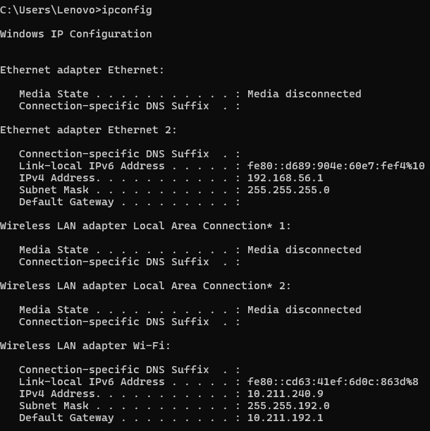
  
## 10.2 Menangkap paket dari eksekusi traceroute
  
Untuk menghasilkan jejak datagram IPv4 untuk bagian pertama modul ini, kita akan menggunakan program traceroute untuk mengirim datagram ke gaia.cs.umass.edu menggunakan syntax "tracert gaia.cs.umass.edu ".
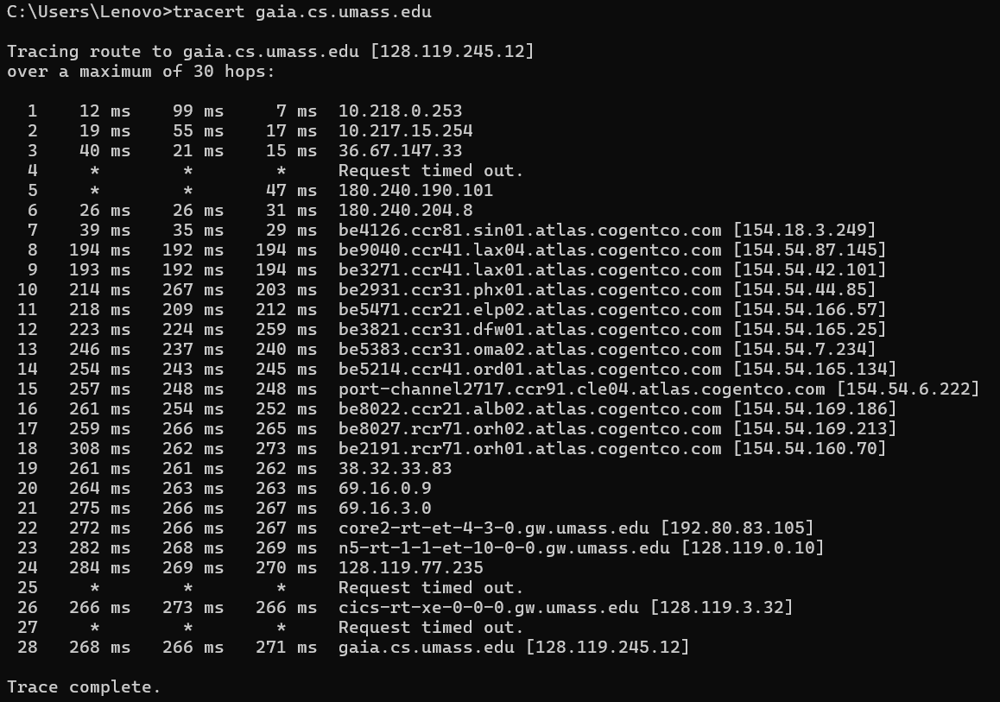
  
### 10.2.1 ICMP, MTU dan TTL
  
- ICMP (Message Control Protocol)
    protokol jaringan yang digunakan untuk mengirim pesan kontrol dan informasi kesalahan pada jaringan IP.
- MTU (Maximum Transmission Unit)
    Ukuran maksimum data yang dapat dikirim dalam satu paket/frame tanpa fragmentasi. Pada Ethernet umumnya 1500 byte.
- TTL (Time To Live)
    Batas jumlah hop/router yang dapat dilewati paket. Setiap router mengurangi TTL sebesar 1. Jika TTL mencapai 0, paket dibuang untuk mencegah routing loop.
  
Pertama buka file abc wireshark capture
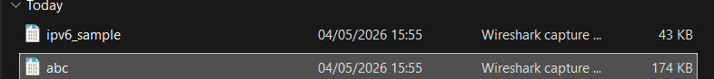
  
Lalu gunakan filter "icmp", disini ttlnya bernilai 1 pada paket pertama.
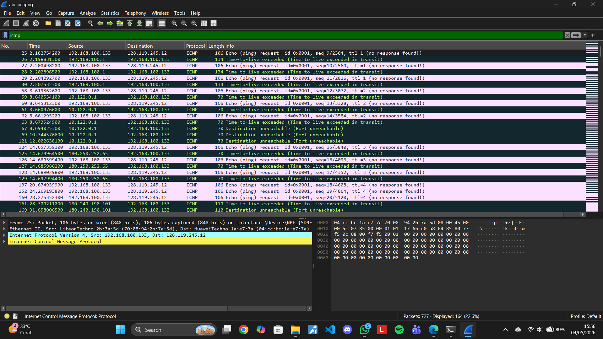
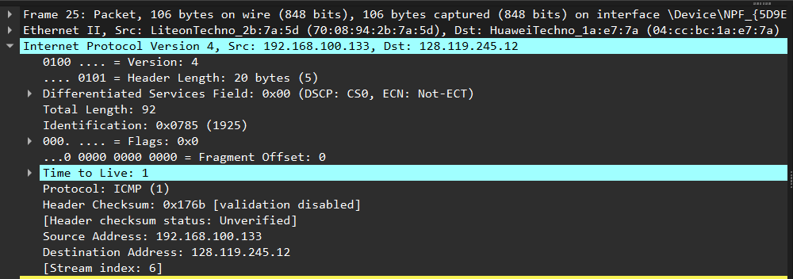
  
Pada paket kedua, ttlnya bernilai 11.

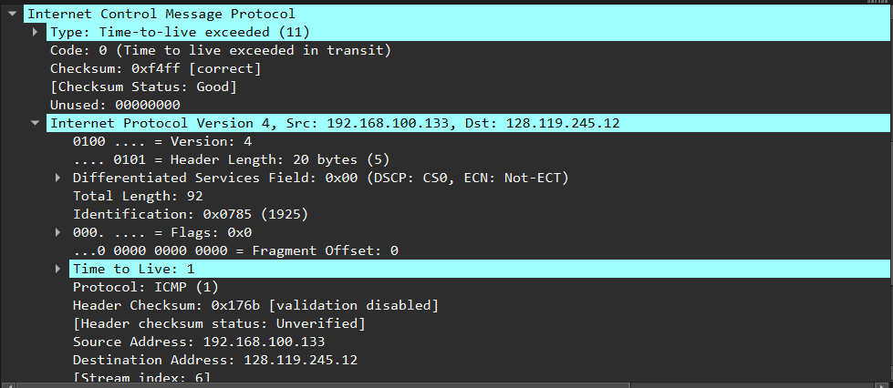
  
### 10.2.2 Fragmentasi
  
Selanjutnya adalah memuat contoh untuk fragmentasi dalam wireshark dengan menggunakan fitur filter "ip.frag_offset>0".Bisa dilihat bawah tidak ada fragmentasi yang offset.
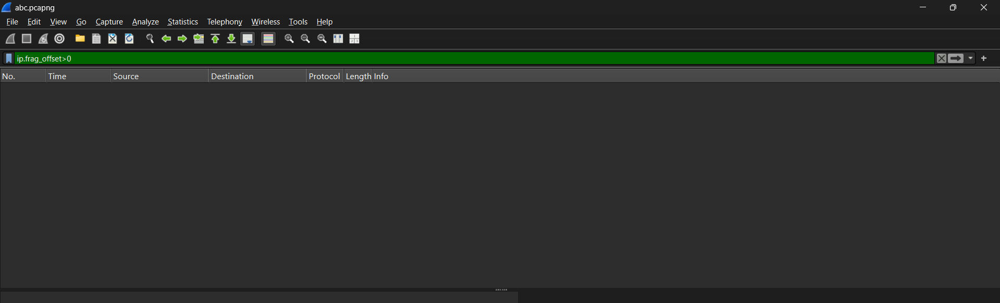
  
Untuk menampilkan fragmentasi yang offset, kita bisa menggunakan perintah "ping 8.8.8.8 -l 4000" untuk memaksa kita mengirimkan 4000 bytes.
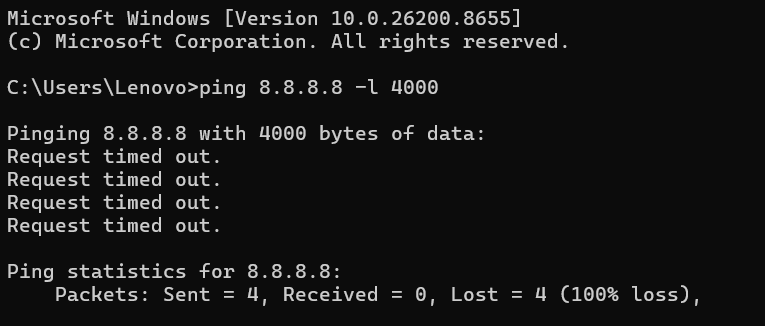
  
Lalu kita jalankan perintah "ip.flags.mf == 1" untuk fragmentasi 1 dan 2.
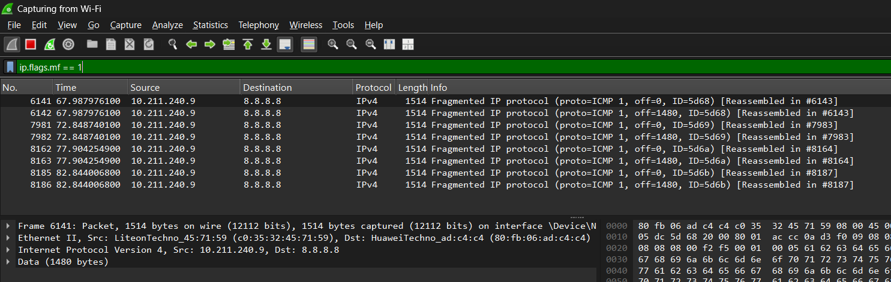
  
lalu kita jalankan perintah "ip.frag_offset > 0" untuk menampilkan fragmentasi 2 dan 3, fragmentasi 1 tidak ditampilkan karena offset fragmentasi 1 selalu 0.
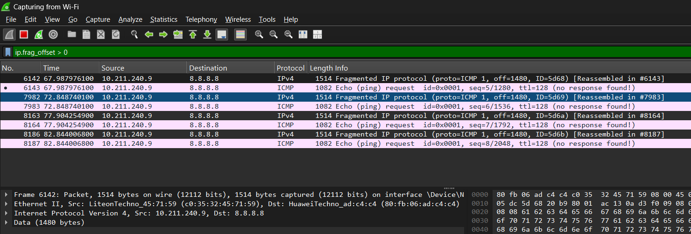
  
### 10.2.3 Bagian 3: IPv6
  
Buka file ipv6_sample.pacp di wireshark lalu gunakan filter "ipv6" karena device ssaya tidak menggunakan IPV6 tapi menggunakan IPV4.
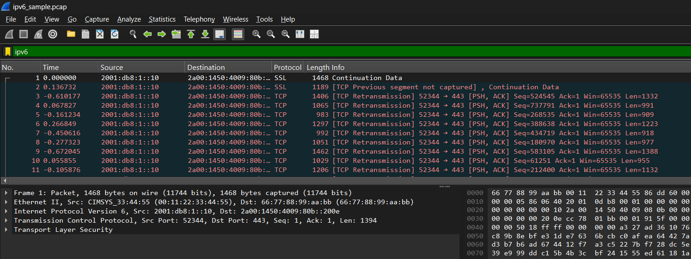