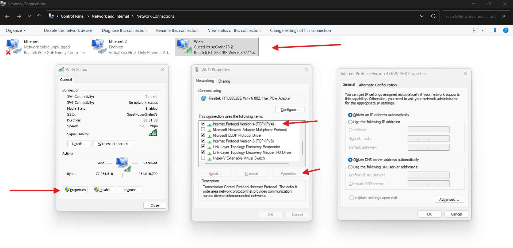
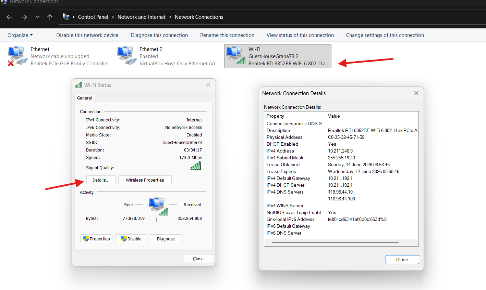
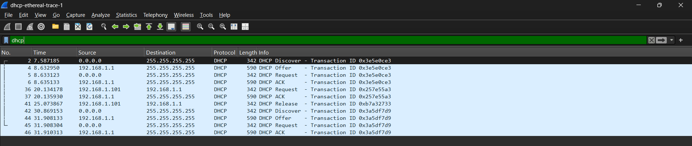

# Laporan praktikun 8 - 11 Mei 2026
  
| Field       | Data                 |
|-------------|----------------------|
| Nama        | Bima Luthfi Nurhakim |
| Nim         | 103072400030         |
| Kelas       | IF-04-05             |
| Mata Kuliah | Jaringan Komputer    |
  
  
## Tujuan Laprak:
- Modul 11: 1. Mahasiswa dapat menginvestigasi cara kerja protokol DHCP menggunakan Wireshark.
  
----------------------------------------------------------------------------------------------------------------------------------
  
## 11.1 Pengantar
  
Di modul ini, kita akan melihat sekilas Dynamic Host Configuration Protocol, DHCP. Ingat bahwa DHCP digunakan secara luas di perusahaan, universitas dan LAN kabel dan nirkabel jaringan rumah untuk secara dinamis menetapkan alamat IP ke host, serta untuk mengkonfigurasi informasi konfigurasi jaringan lainnya. Seperti yang telah kami lakukan di lab Wireshark sebelumnya, Anda akan melakukan beberapa tindakan di komputer Anda yang akan menyebabkan DHCP beraksi, dan kemudian menggunakan Wireshark untuk mengumpulkan dan kemudian jejak paket yang berisi pesan protokol DHCP.
  
## Langkah-langkah Modul 11
  
### DHCP
DHCP sendiri itu adalah Dynamic Host Configuration Protocol. ini biasa digunakan oleh banyak jaringan LAN dimana ia memberikan IP secara otomatis oleh router atau penyedia DHCP sehingga meminimalisirkan terjadinya tabrakan IP antar clientnya. berikut dibawah ini contoh untuk melihat IP yang diberikan oleh router dijaringan LAN adalah masuk pada network connection lalu memilih jaringan yang saat ini terhubung. contoh seperti dibawah gambar ini. ia mendaptkan IP "10.211.240.9" dengan dns servernya yaitu "118.98.44.10".
  

  
### Kelebihan dan Kekurangan DHCP
  
| Kelebihan                                      | Kekurangan                                            |
|------------------------------------------------|-------------------------------------------------------|
| Lebih cepat dan praktis                        | Sulit melakukan tracking perangkat berdasarkan IP     |
| Konfigurasi IP otomatis                        | Memerlukan konfigurasi dan pengelolaan server DHCP    |
| Mengurangi IP conflict (bentrok IP)            | IKetergantungan pada server DHCP                      |
| Mengurangi kesalahan konfigurasi (invalid IP)  | Kurang cocok untuk perangkat yang memerlukan IP tetap |
| Mudah dikelola untuk banyak perangkat          |                                                       |
  
### DORA
  
DORA yang berarti, discover, offer, request, acknowledge.  
- Discover Pertama client akan bertanya apakah ada DHCP server?, Seperti contoh dibawah dimana sourcenya 0.0.0.0 dan destinationnya 255.255.255.255.
- Offer merupakan sikap server menawarkan alamat IP kepada client.
- Request merupakan tahap dimana client meminta atau menyetujui penawaran IP dari server.
- Acknowledge dimana server mengirimkan konfirmasi bahwa IP tersebut resmi disewakan ke client. berikut seperti dibawah ini adalah contoh penerapannya dalam wireshark.
