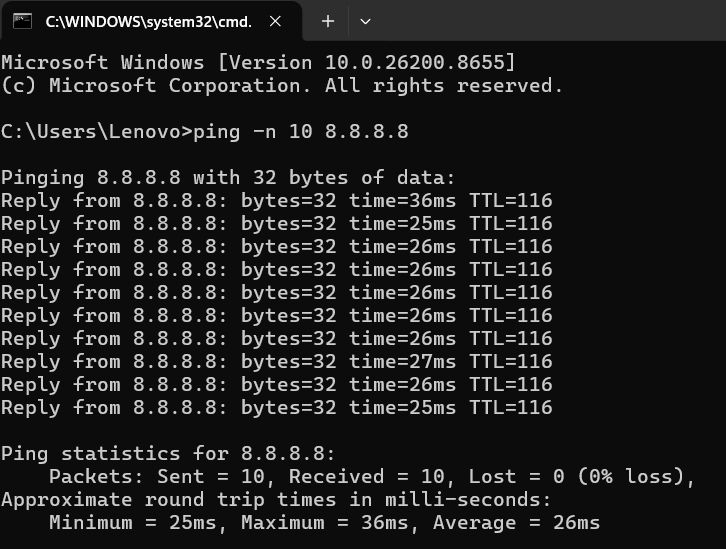
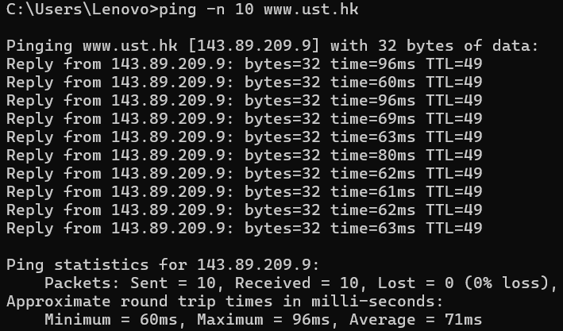
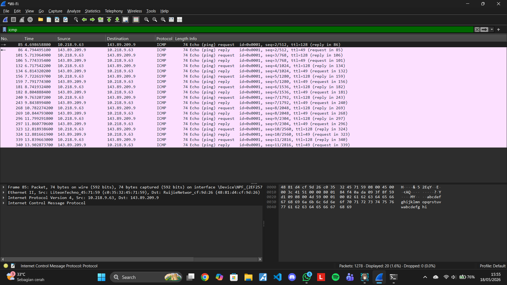
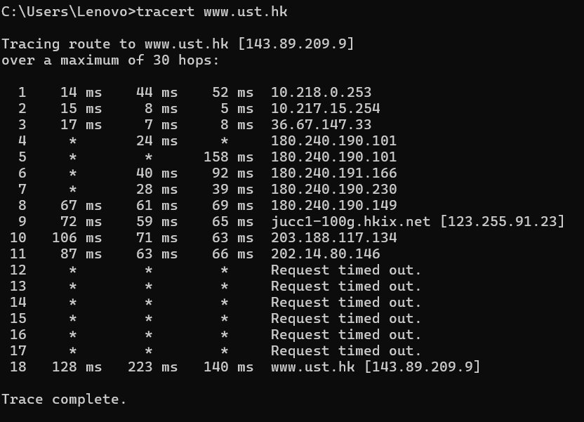
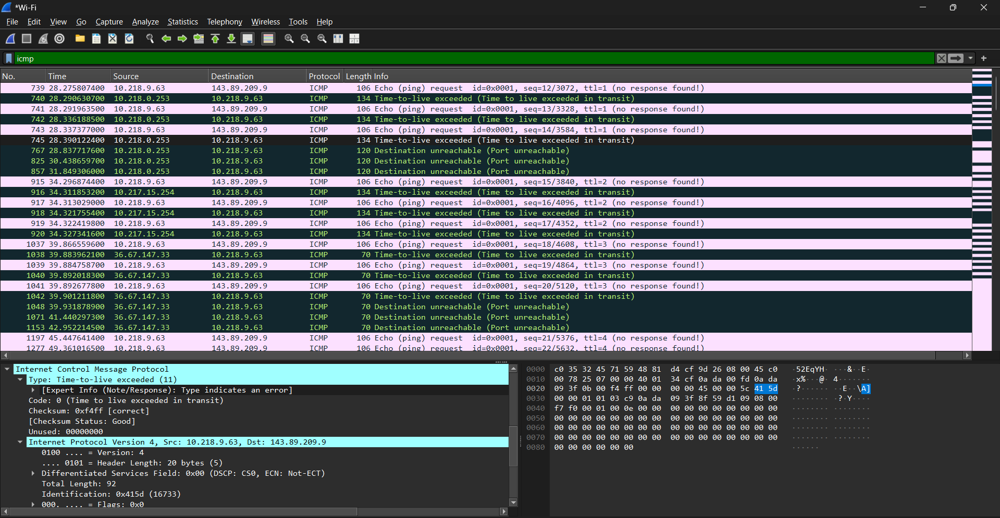
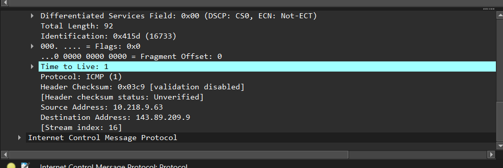

# Laporan praktikun 9 - 18 Mei 2026
  
| Field       | Data                 |
|-------------|----------------------|
| Nama        | Bima Luthfi Nurhakim |
| Nim         | 103072400030         |
| Kelas       | IF-04-05             |
| Mata Kuliah | Jaringan Komputer    |
  
  
## Tujuan Laprak:
- Modul 12: 1. Mahasiswa dapat menginvestigasi cara kerja protokol ICMP menggunakan Wireshark.
- Modul 12: 2. Mahasiswa dapat membuat program ICMP Pinger.
- Modul 12: 3. Mod Melakukan asistensi dan laporan progress pengerjaan tugas besar.
  
----------------------------------------------------------------------------------------------------------------------------------
  
## 12.1 Pengantar
  
Di modul ini, kita akan mengeksplorasi beberapa aspek dari protokol ICMP:   
- Pesan ICMP yang dihasilkan oleh program Ping;
- Pesan ICMP yang dihasilkan oleh program Traceroute;
- format dan isi pesan ICMP.  
Kami menyajikan lab ini dalam konteks sistem operasi Microsoft Windows. Namun, sangat mudah untuk menerjemahkan lab ke lingkungan Unix atau Linux. 
  
## Langkah-langkah Modul 12
  
ICMP digunakan pada:
1. mengecek host dalam jaringan
2. Mengetahui hop(jalur)
3. Memberikan informasi error
  
Hubungan IP dan ICMP adalah paket IP mengirim data playload = ICMP.
  
### Pesan ICMP yang dihasilkan oleh program Ping
  
Langkah pertama untuk mengimplementasikan pesan ICMP yang dihasilkan program ping adalah membuka command terminal windows. kemudian mengetikkan syntax "ping -n 10 8.8.8.8" dimana -n itu adalah merupakan batas maksimal yang dapat dijalankan oleh terminal sedangkan 10 adalah nilai atau jumlah x yang ingin ditentukan seberapa banyak baris untuk ngetrack pesan pingnya. seperti pada contoh gambar dibawah ini terdapat beberapa pesan yang sempurna atau jaringan sedang berjalan dengan normal tanpa terjadi request time out yang berarti beberapa data hilang.

  
Selanjutnya ketik syntax "ping -n 10 www.ust.hk".

  
Selanjutnya jika dilihat melalui wireshark maka akan terdapat beberapa track dimana masing - masing track tersebut menerangkan reply dan request jika misal melihat koneksi sebanyak 10 maka total baris yang akan keluar adalah 20 dimana 10 milik request dan 10 lagi milik reply.

  
### Pesan ICMP yang dihasilkan oleh program Traceroute
  
Sekarang mari kita lanjutkan petualangan ICMP kita dengan menangkap paket yang dihasilkan oleh program Traceroute. Anda mungkin ingat bahwa program Traceroute dapat digunakan untuk mengetahui jalur yang diambil paket dari sumber ke tujuan. Source mengirimkan serangkaian paket ICMP ke tujuan target.  program mengirimkan paket pertama dengan TTL=1, paket kedua dengan TTL=2, dan seterusnya. Ingatlah bahwa router akan mengurangi nilai TTL paket saat paket melewati router. Ketika sebuah paket tiba di router dengan TTL=1, router mengirimkan paket kesalahan ICMP kembali ke sumbernya. ketik syntax "tracert www.ust.hk" di CMD.

  
Kemudian buka Wireshark dengan capture WIFI, lalu filter "icmp".

  
| Field              | Panjang |                                                                                                   |
|--------------------|---------|-------------------------------------------------------------------------------------------------- |
| Type               | 8 bit   | Menentukan jenis atau kategori utama dari pesan ICMP yang dikirimkan.                             |
| Code               | 8 bit   | Memberikan informasi atau sub-kategori yang lebih spesifik mengenai Type.                         |
| Checksum           | 16 bit  | Digunakan untuk mendeteksi apakah terjadi kerusakan paket selama proses transmisi.                |
| Rest of The Header | 32 bit  | Bagian header tambahan yang isinya bervariasi tergantung pada nilai Type dan Code yang digunakan. |
| Data Section       | Dynamic | Tempat diletakkannya muatan utama yaitu payload atau informasi tambahan dari pesan ICMP.          |