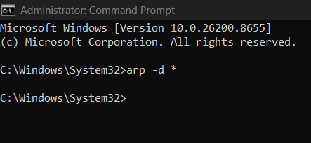
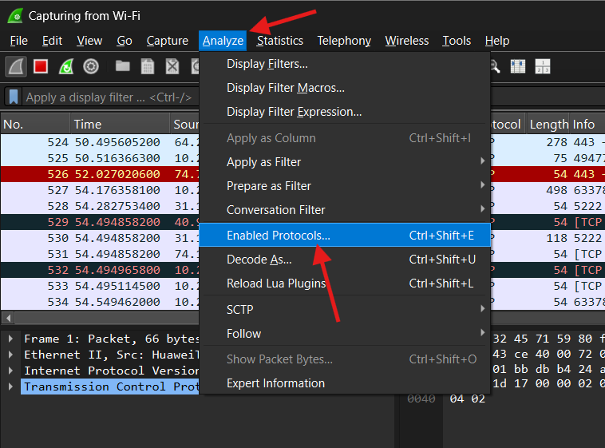
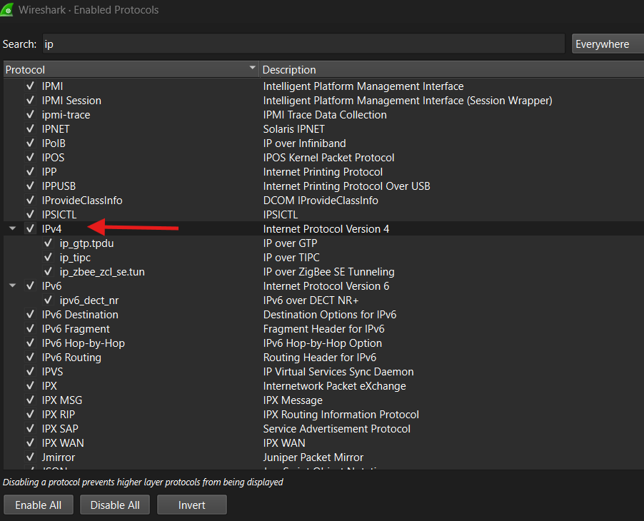
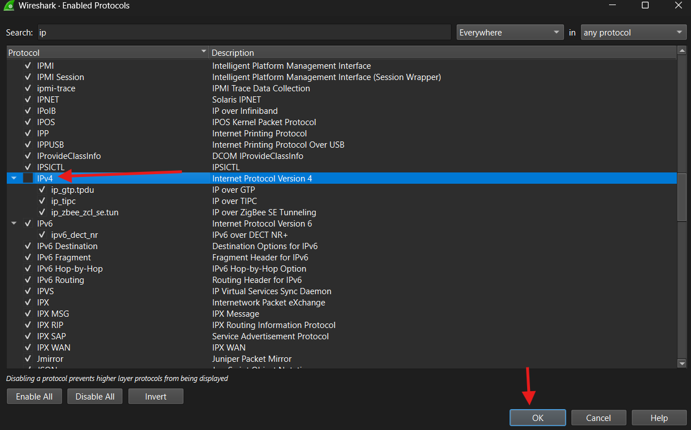
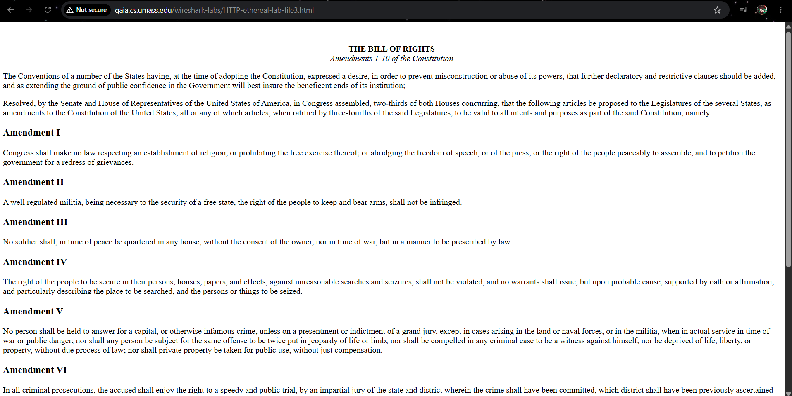
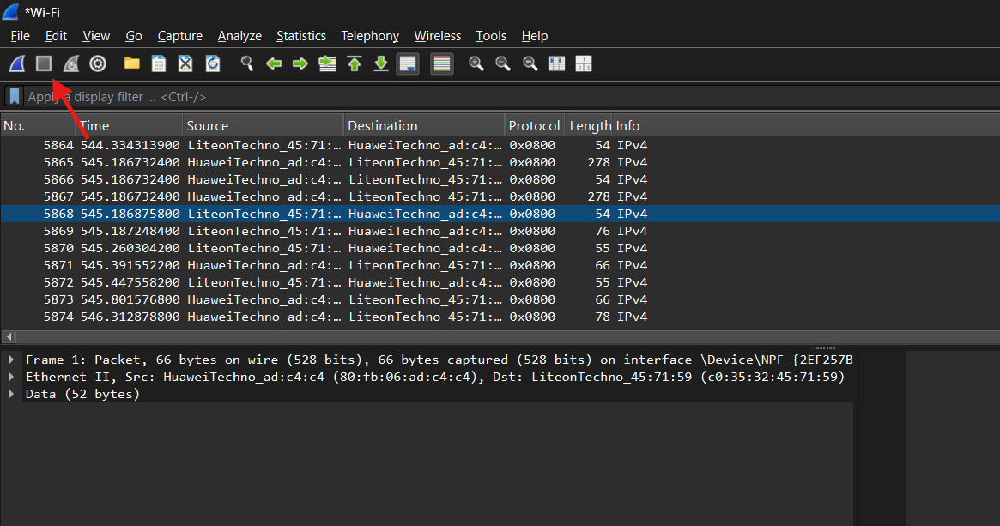
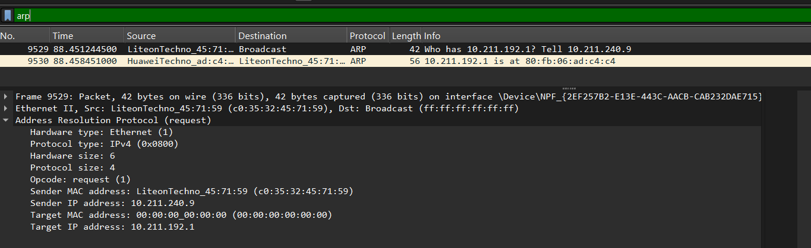

# Laporan praktikun 13 - 5 Juni 2026
  
| Field       | Data                 |
|-------------|----------------------|
| Nama        | Bima Luthfi Nurhakim |
| Nim         | 103072400030         |
| Kelas       | IF-04-05             |
| Mata Kuliah | Jaringan Komputer    |
  
  
## Tujuan Laprak:
- Modul 13: 1. Mahasiswa dapat menginvestigasi cara kerja Ethernet dan ARP menggunakan Wireshark.
  
----------------------------------------------------------------------------------------------------------------------------------
  
## 13.1 Pengantar
  
Di lab ini, kami akan menyelidiki protokol Ethernet dan protokol ARP. RFC 826 (ftp://ftp.rfceditor.org/in-notes/std/std37.txt) berisi detail mengerikan dari protokol ARP, yang digunakan oleh perangkat IP untuk menentukan alamat IP dari antarmuka jarak jauh yang alamat Ethernetnya diketahui.
  
## Langkah-langkah Modul 13
  
Buka CMD sebagai Administrator, lalu ketik syntax "arp -d *".

  
Kemudian buka Wireshark, klik Analyze, klik Enabled Protocols.

  
Lalu cari IPv4, kemudian unchecklist, lalu klik ok.

  
Lalu buka modul dan salin URL berikut: [Bill of Right AS](http://gaia.cs.umass.edu/wireshark-labs/HTTP-ethereal-lab-file3.html), kemudian akan menampilkan tampilan seperti dibawah ini:

  
Kemudian kembali ke Wireshark dan klik stop.

  
Gunakan filter "arp" untuk mencari protocol ARP, disini terdapat 2 packet protocol ARP dan salah satunya destination berupa Broadcast, dapat dilihat disini bahwa arp akan bertanya seperti siapa yang punya ip 10.211.192.1? beritau pada 10.211.240.9 agar dapat berkomunikasi lebih lanjut, kita juga dapat melihat semua alamat MAC yang tersedia.
