# Laporan praktikun 11 - 8 Juni 2026
  
| Field       | Data                 |
|-------------|----------------------|
| Nama        | Bima Luthfi Nurhakim |
| Nim         | 103072400030         |
| Kelas       | IF-04-05             |
| Mata Kuliah | Jaringan Komputer    |
  
  
## Tujuan Laprak:
- Modul 14: 1. Mahasiswa dapat menginvestigasi cara kerja WiFi menggunakan Wireshark.
  
----------------------------------------------------------------------------------------------------------------------------------
  
## 14.1 Pengantar
  
IEEE 802.11 merupakan standar komunikasi jaringan nirkabel yang dikembangkan oleh Institute of Electrical and Electronics Engineers (IEEE). Standar ini menjadi dasar teknologi Wi-Fi dan mengatur proses pertukaran data pada jaringan WLAN (Wireless Local Area Network), terutama pada lapisan fisik (Physical Layer) dan lapisan pengendalian akses media (Media Access Control/MAC).
  
## Langkah-langkah Modul 14
  
## 14.2 Perbandingan Frekuensi WI-FI
  
1. Frekuensi 2,4 GHz
- Kelebihan: Mampu menjangkau area yang lebih luas serta memiliki kemampuan yang cukup baik dalam menembus dinding maupun hambatan fisik lainnya.
- Kekurangan: Kecepatan transfer data cenderung lebih rendah dan lebih mudah mengalami interferensi karena banyak perangkat elektronik lain yang menggunakan frekuensi yang sama.  
2. Frekuensi 5 GHz
- Kelebihan: Menawarkan kecepatan transfer data yang lebih tinggi dengan tingkat gangguan sinyal yang lebih rendah.
- Kekurangan: Cakupan sinyal lebih terbatas dan performanya dapat menurun ketika terhalang oleh dinding atau material padat lainnya.
  
## 14.3 Beacon Frames 
Pertama buka file Wireshark_802_11.

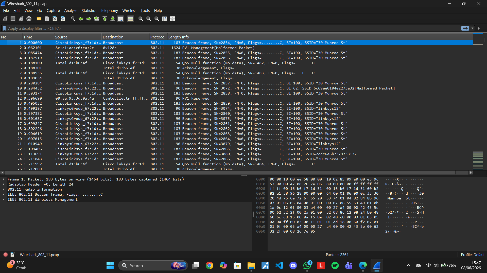
  
Kemudian gunakan filter "wlan.fc.subtype == 8", untuk menampilkan Beacon Frames (bingkai suar) dalam lalu lintas jaringan nirkabel (Wi-Fi).
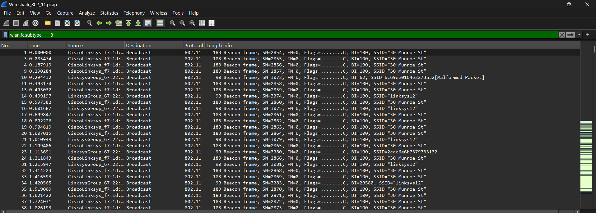
  
Kemudian gunakan filter "wlan.fc.subtype == 8 && wlan.fc.type == 0", untuk menampilkan Beacon Frames (bingkai suar) dalam lalu lintas jaringan nirkabel (Wi-Fi).
```
SSID = "30 Munroe St"
Beacon Interval(BI)=100 TU (Time Unit)
1 TU = 1024 μs

maka:
100 × 1024 μs
≈ 102.4 ms
Artinya AP mengirim beacon sekitar setiap 102 ms.
```
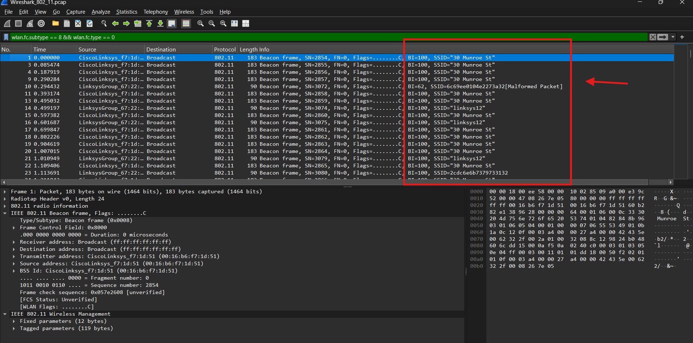
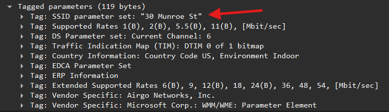
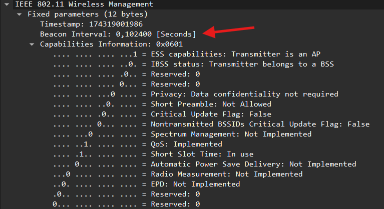
  
Setelah itu kita filter lagi dengan "tcp.port == 80" atau "ip.addr == 128.119.245.12", lalu cari protocol HTTP.  
tcp.port == 80
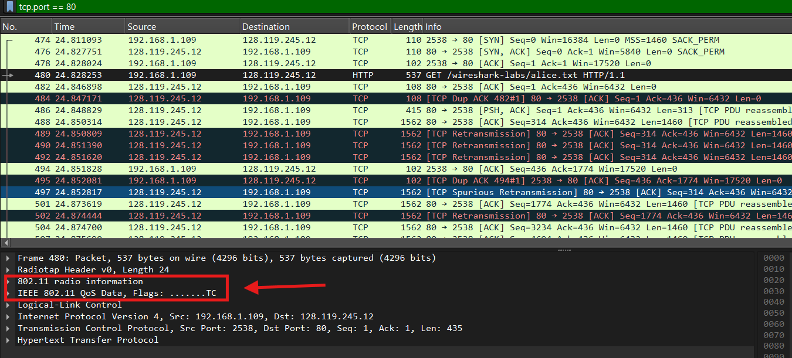
  
ip.addr == 128.119.245.12
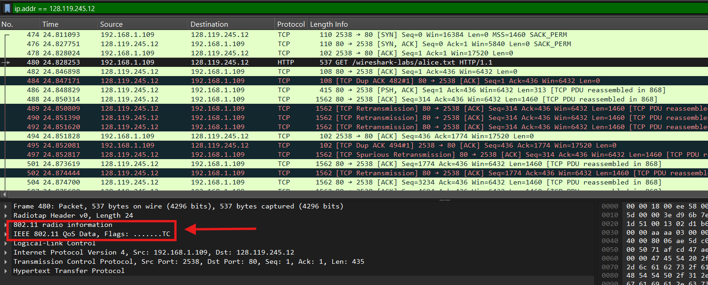
Kita dapat melihat penangkapan paket terhadap alice.txt, dan pada file ini jelas sebuah paket memiliki informasi tambahan seperti radio dan informasi IEEE, yang jelas tidak ada pada modul sebelumnya, karena kita belajar bahwa user tidak langsung connect ke sebuah router namun ada invisible wireless sebagai perantara jaringan.
  
Kita juga dapat melihat informasi tambahan seperti MAC address yang digunakkan.
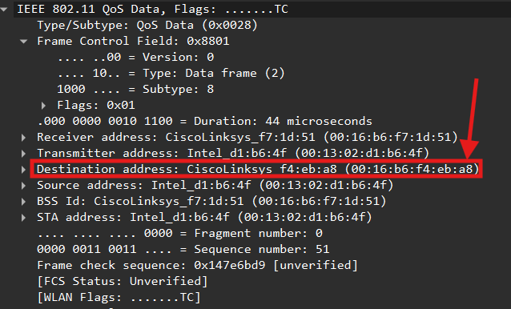
  
Kemudian kita lanjut ke associate request dan respond yang akan terjadi ketika kita berpindah dari suatu AP ke AP yang lain, kita dapat menerapkan filter "wlan.fc.type_subtype == 0" untuk memfilter sebuah request.
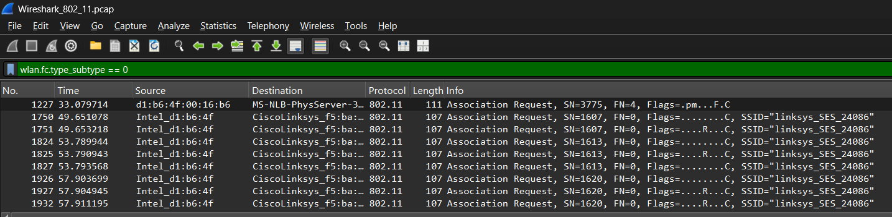
  
Kita dapat melihat expand packet awal atau Frame 1750, klien mencoba berasosiasi ke AP dengan SSID "linksys_SES_24086". disini bahwa waktu dalam dan association request disini adalah 314 microseconds.
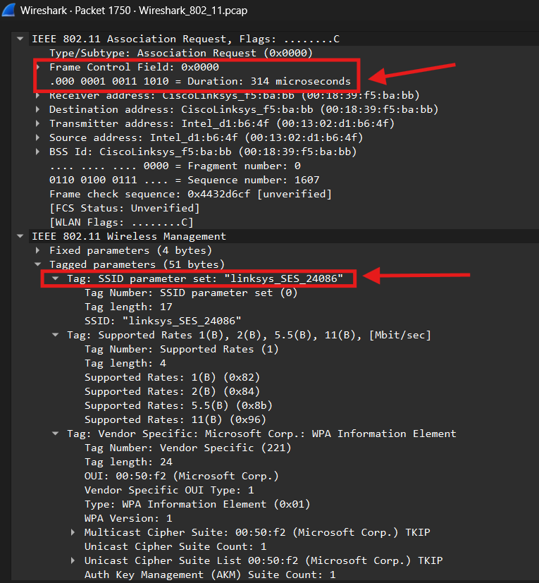
  
Dan expand packet akhir atau Frame 2162, klien berpindah dan mengirim permintaan asosiasi baru ke AP dengan SSID "30 Munroe St" dan association request disini adalah 44 microseconds.
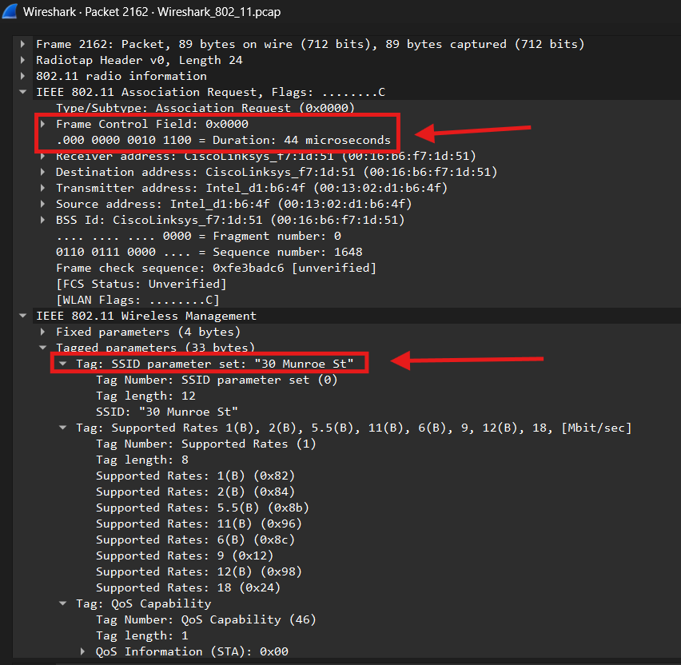
  
Selanjutnya gunakan filter "wlan.fc.type_subtype == 1" untuk menganalisis tanggapan Asosiasi (Association Response).
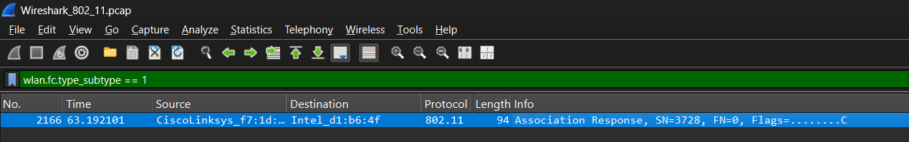
  
Ditemukan Frame 2166 yang merupakan Association Response. Di sini, Transmitter Address diisi oleh MAC Address milik perangkat pengirim respon, yaitu CiscoLinksys_f7:1d:51 , sebagai tanda bahwa Access Point menyetujui permintaan koneksi dari klien (Intel_d1:6b:4f).
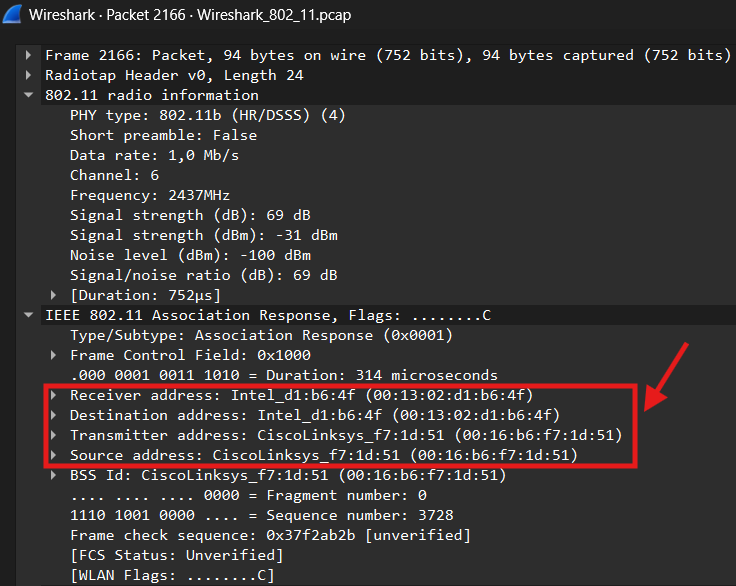
  
Terakhir kita dapat menggunakan filter "wlan.fc.subtype == 10" / disini menggunakan "wlan.fc.subtype == 0x0a" dalam hexa untuk melihat respond yang diberikan, namun tidak ada paket respond yang terlihat dalam file zip tersebut.
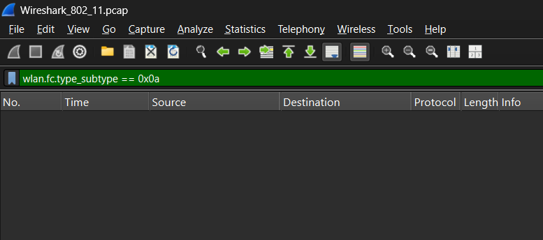