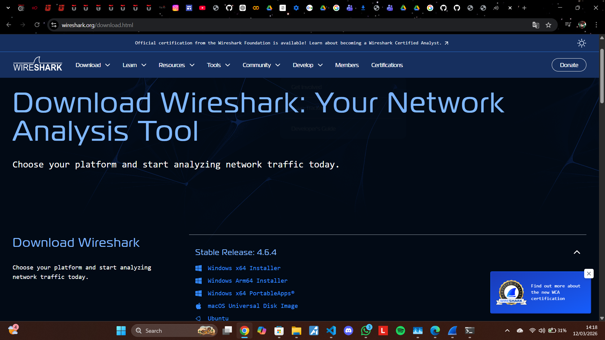
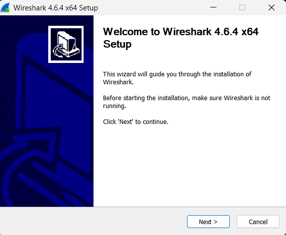
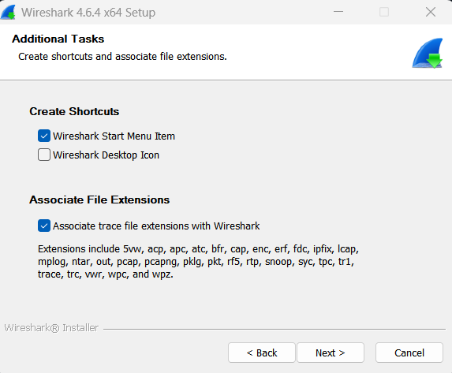
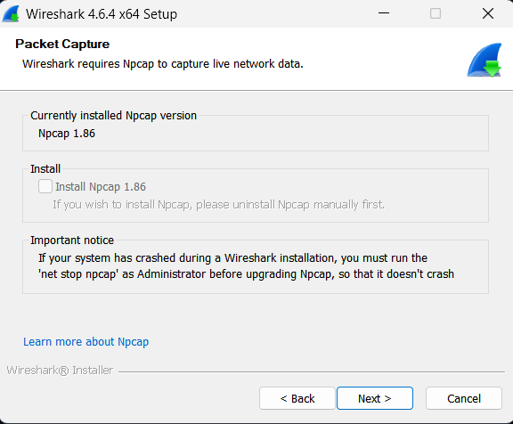
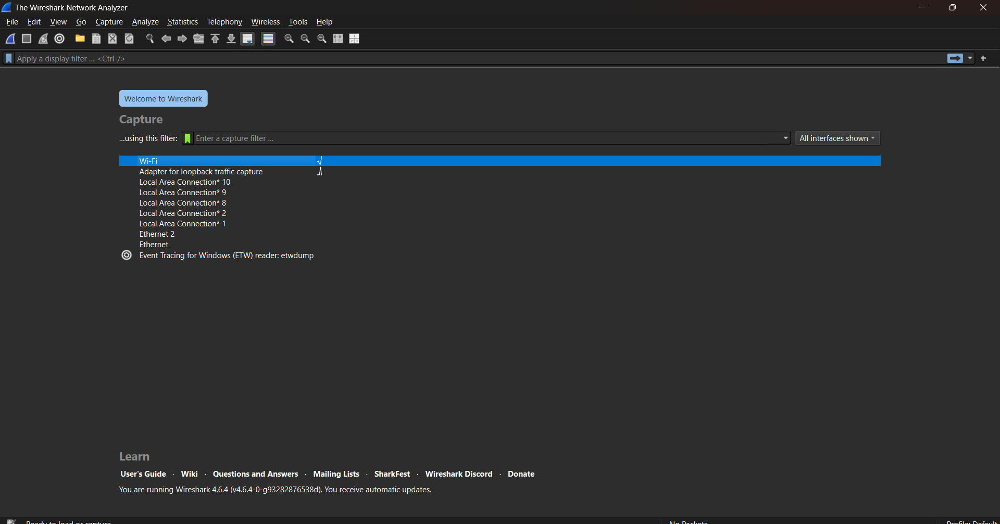
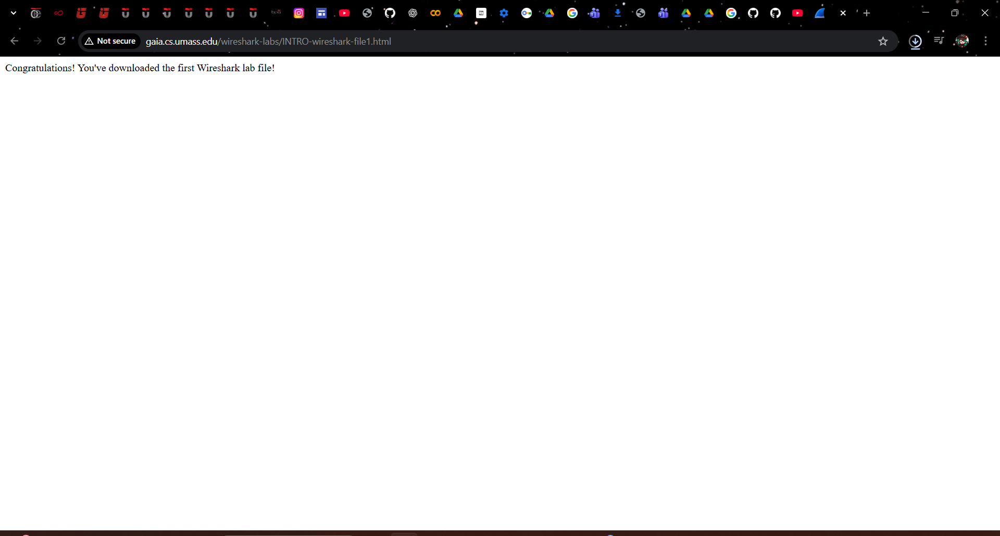
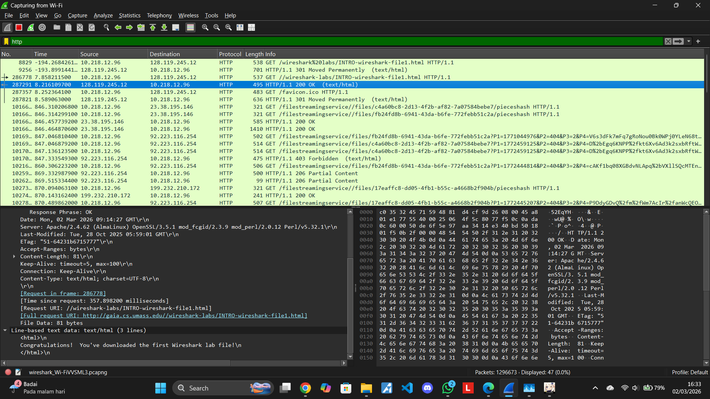
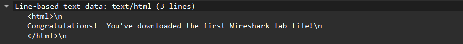
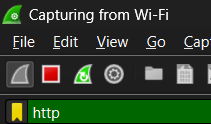

# Laporan praktikun 1 - 6, Maret 2026
Nama        : Bima Luthfi Nurhakim
Nim         : 103072400030
Kelas       : IF-04-05
Mata Kuliah : Jaringan Komputer

## Tujuan Laprak:
Modul 1 - Cara menginstall Wireshark
Modul 2 - Cara menggunakan Wireshark dan toolsnya

## Langkah-langkah Modul 1

1. Buka website https://www.wireshark.org/download.html dan download sesuai OS Laptop masing-masing, karena saya pakai Windows maka saya mendownload Wireshark Windows x64 Installer.

2. Setelah selesai mendownload, buka Wireshark dan selesaikan penginstallannya.

## Langkah - langkah Modul 2

1. Buka Wireshark lalu untuk capture pilih WIFI.

2. Buka file pdf modul jarkom lalu salin lik dari modul 2 http://gaia.cs.umass.edu/wireshark-labs/INTRO-wireshark-file1.html, lalu tempelkan ke browser.

2. Lalu kembali ke Wireshark dan cari "http"(tanpa tanda kutip). lalu klik yang berteks "(teks/html)"(tanpa tanda kutip).

3. klik "line-based text data" yang akan menampilkan:

4. Untuk keluar klik ikon persegi pada pojok kiri atas:

   Lalu klik ikon "x" pada pojok kanan atas:
