# Laporan praktikun 2 - 12, Maret 2026
Nama        : Bima Luthfi Nurhakim  
Nim         : 103072400030  
Kelas       : IF-04-05  
Mata Kuliah : Jaringan Komputer  
  
  
## Tujuan Laprak:
- Modul 3: Mahasiswa dapat menginvestigasi cara kerja protokol HTTP menggunakan Wireshark.  
  
## Langkah-langkah Modul 3
1. Buka Wireshark.
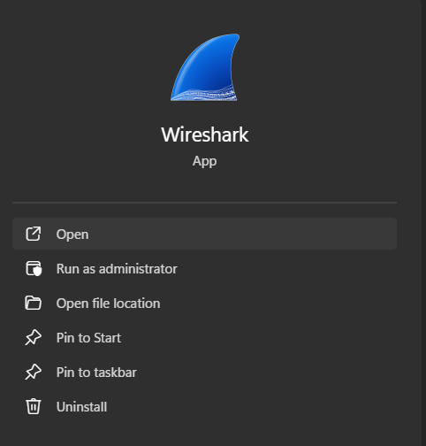

2. Pada bagian capture pilih **WIFI**, setelah itu wireshark otomatis berjalan.

### LINK 1 Basic HTTP GET/response interaction
3. Lalu buka browser dan tempelkan link ini, http://gaia.cs.umass.edu/wireshark-labs/HTTP-wireshark-file1.html.
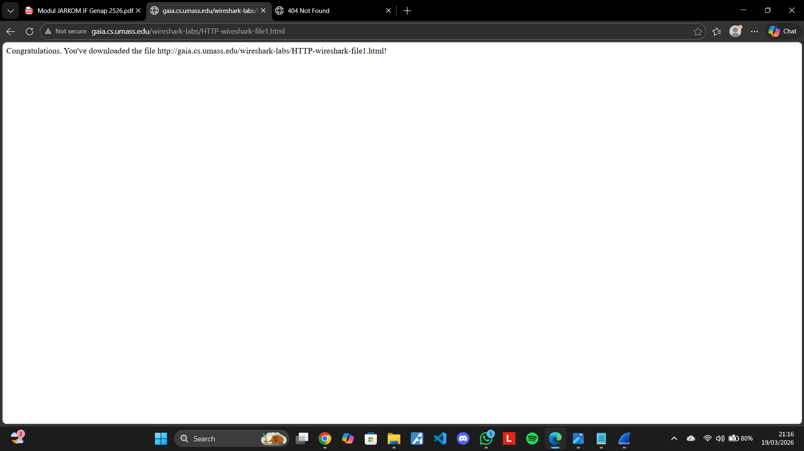

4. Buka wireshark kembali dan ketik "http"(tanpa tanda kutip) di pencarian dan klik enter. Cari baris yang length info-nya berteks **200 ok (text/html)**, lalu kita bisa melihat hypertext dan Line-based text datanya.
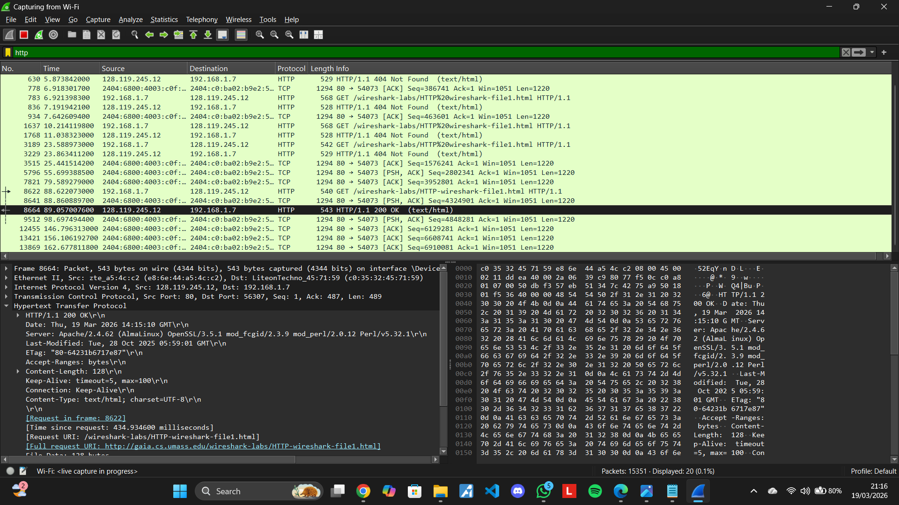
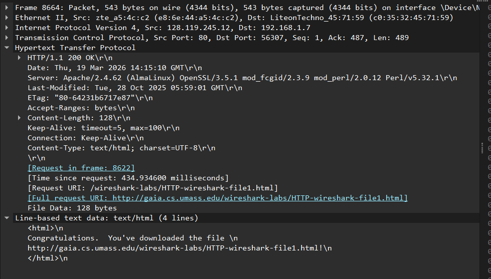

### LINK 2 HTTP CONDITIONAL GET/response interaction
5. Lalu buka browser kembali dan tempelkan link ini, http://gaia.cs.umass.edu/wireshark-labs/HTTP-wireshark-file2.html.
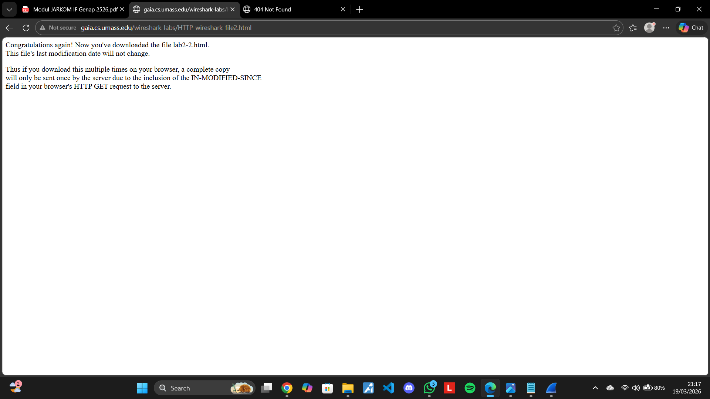

6. Buka wireshark kembali dan ketik "http"(tanpa tanda kutip) di pencarian dan klik enter. Cari baris yang length info-nya berteks **200 ok (text/html)**, lalu kita bisa melihat hypertext dan Line-based text datanya.
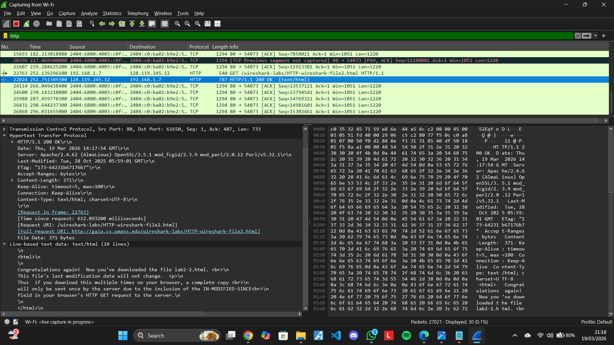

### LINK 3 etrieving Long Documents
7. Lalu buka browser kembali dan tempelkan link ini, http://gaia.cs.umass.edu/wireshark-labs/HTTP-wireshark-file3.html.
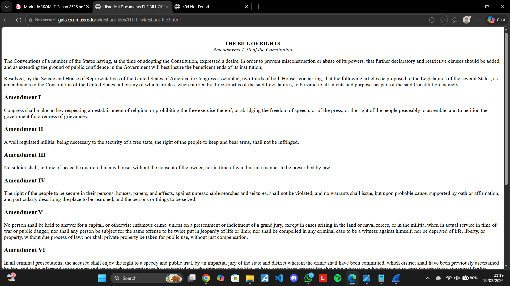

8. Buka wireshark kembali dan ketik "http"(tanpa tanda kutip) di pencarian dan klik enter. Cari baris yang length info-nya berteks **200 ok (text/html)**, lalu kita bisa melihat hypertext dan Line-based text datanya.
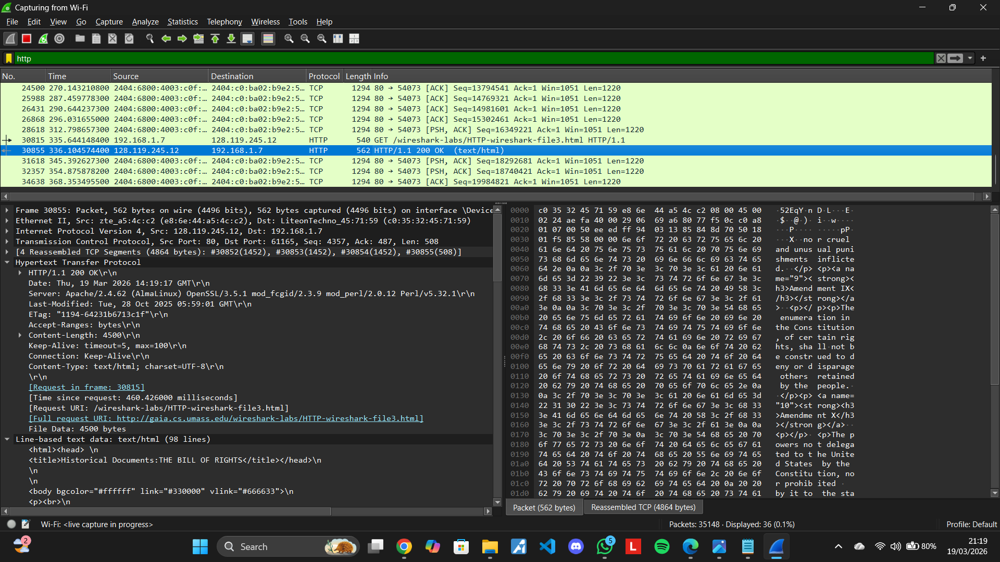
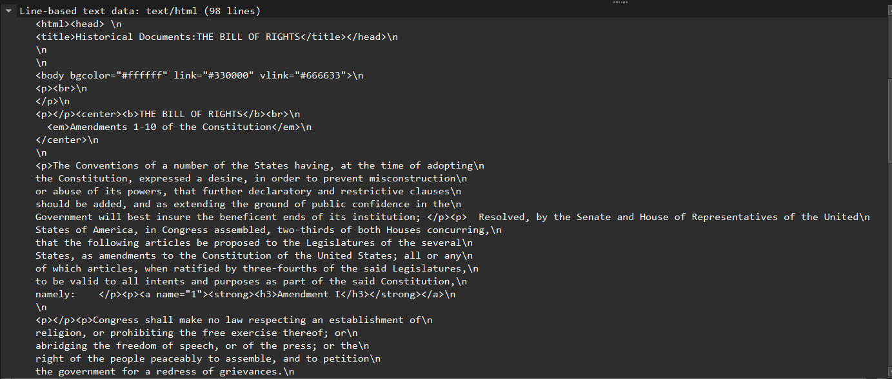
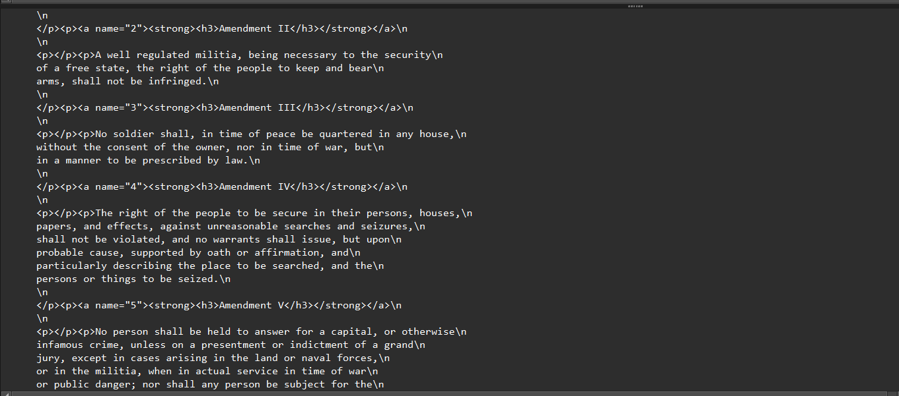

### LINK 4 HTML Documents dengan Embedded Objects
9. Lalu buka browser kembali dan tempelkan link ini, http://gaia.cs.umass.edu/wireshark-labs/HTTP-wireshark-file4.html.
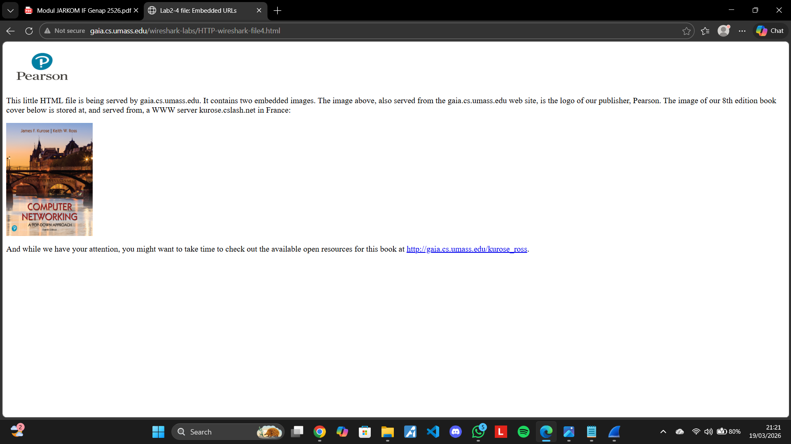

10. Buka wireshark kembali dan ketik "http"(tanpa tanda kutip) di pencarian dan klik enter. Cari baris yang length info-nya berteks **200 ok (text/html)**, lalu kita bisa melihat hypertext dan Line-based text datanya.
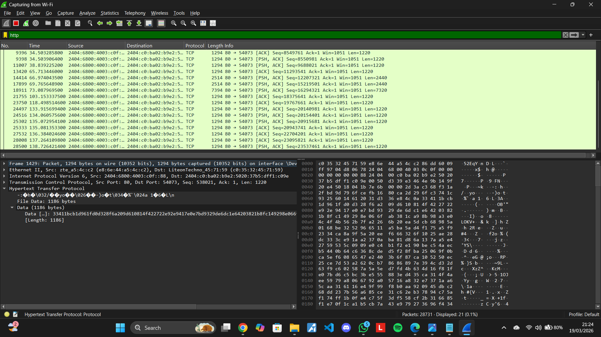

### LINK 5 HTTP Authentication
11. Lalu buka browser kembali dan tempelkan link ini, http://gaia.cs.umass.edu/wireshark-labs/protected_pages/HTTP-wireshark-file5.html. Disini ada dua skenario yaitu berhasil masuk atau gagal masuk(username dan password salah, username salah, dan password salah). Pertama coba skenario yang gagal masuk. Kita masukkan username dan password salah, lalu klik sign in.
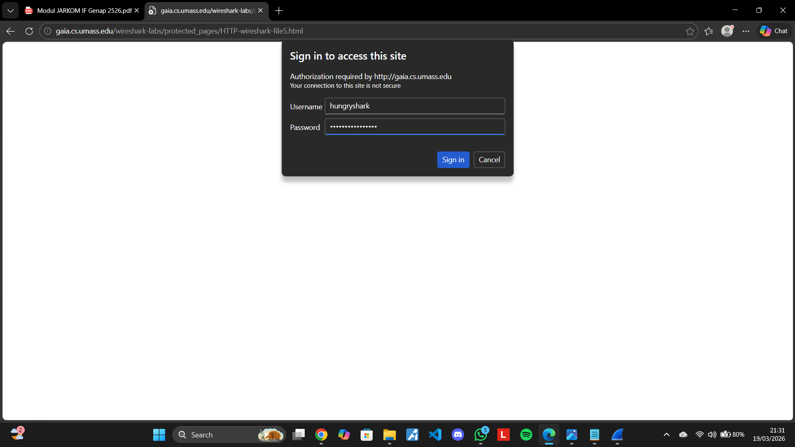

12. setelah kita klik sing in, kita diminta memasukkan username dan passowrd lagi. Jadi hasil dari skenario username dan passowrd salah adalah diminta memasukkan username dan passowrd dengan benar.
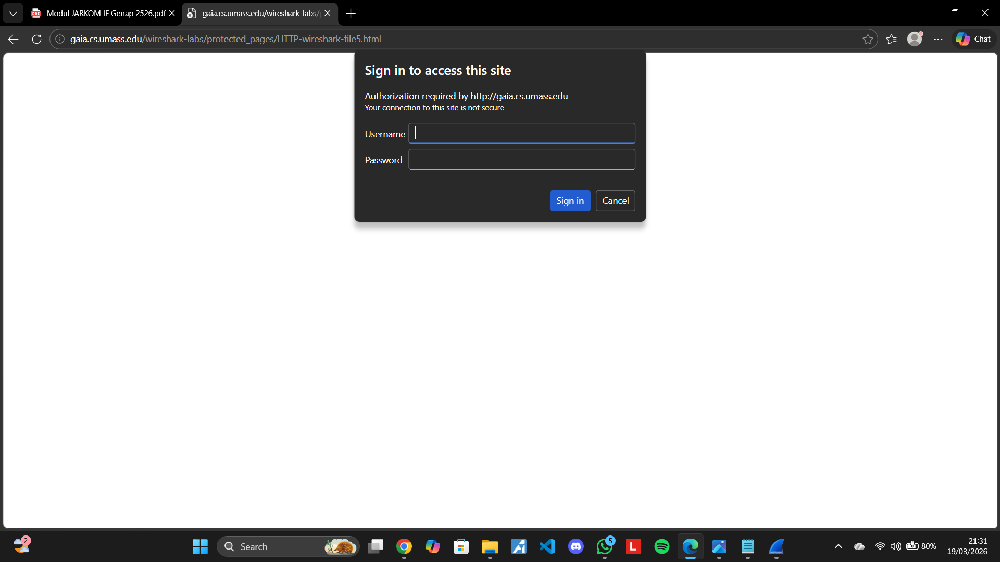

13. Buka wireshark kembali dan ketik "http"(tanpa tanda kutip) di pencarian dan klik enter. Cari baris yang length info-nya berteks **200 ok (text/html)**, lalu kita bisa melihat hypertext dan Line-based text datanya.
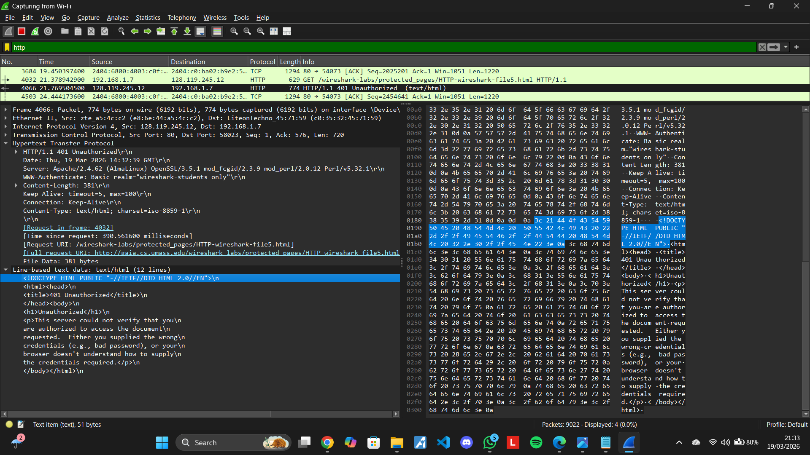

14. Kita coba skenario berhasil masuk dengan **username:** wireshark-students dan **password:** network, kita klik sign in.
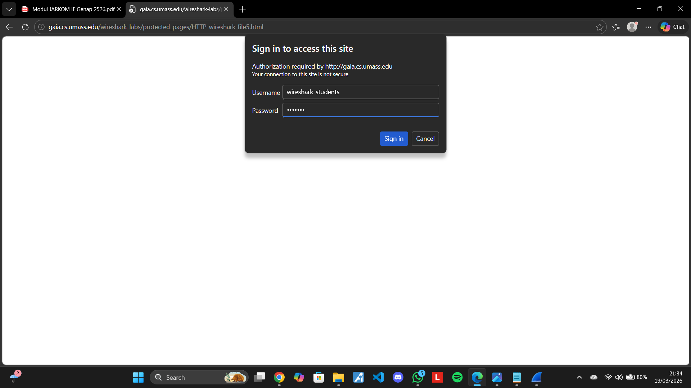

15. Kita berhasil masuk.
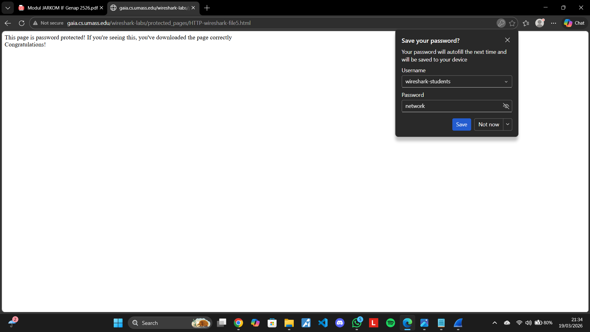

16. Buka wireshark kembali dan ketik "http"(tanpa tanda kutip) di pencarian dan klik enter. Cari baris yang length info-nya berteks **200 ok (text/html)**, lalu kita bisa melihat hypertext dan Line-based text datanya.
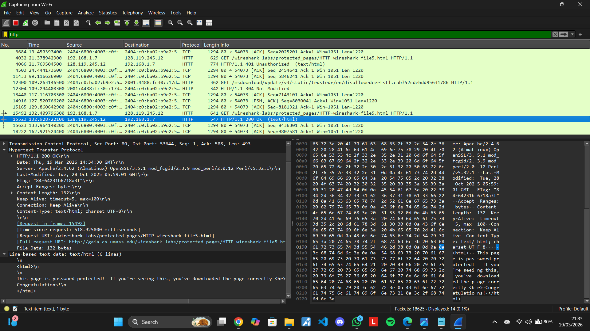

17. Setelah selesai, klik ikon kotak merah di pojok kiri atas untuk memberhnetikan wireshark.
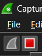

18. Lalu kelluar dengan klik tanda X di pojok kanan atas.
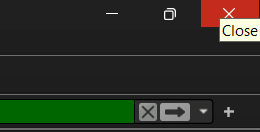

19. Lalu pilih **Out without Saving**
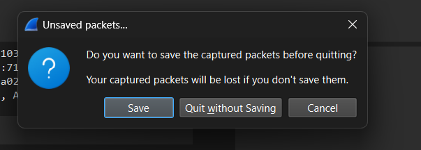