# Laporan praktikun 3 - 30, Maret 2026
Nama        : Bima Luthfi Nurhakim  
Nim         : 103072400030  
Kelas       : IF-04-05  
Mata Kuliah : Jaringan Komputer  
  
  
## Tujuan Laprak:
- Modul 4: Mahasiswa dapat menginvestigasi cara kerja DNS menggunakan Wireshark  
- Modul 5: Mahasiswa dapat menginvestigasi cara kerja protokol UDP menggunakan Wireshark  
  
## Langkah-langkah Modul 4
  
## Nslookup
>Pada modul ini, kita akan menggunakan perintah nslookup yang tersedia pada sebagian besar platform Linux/Unix dan Microsoft Untuk menjalankan nslookup di Linux/Unix, cukup ketik perintah nslookup pada Command Line. Untuk menjalankannya di Windows, buka Command Prompt dan ketik nslookup pada baris perintah. Dalam operasi yang paling dasar, nslookup memungkinkan host yang menjalankan perintah untuk bertanya mengenai suatu server DNS dan mendapatkan informasi DNS dari server tersebut. Server DNS yang ditanyakan dapat berupa server DNS root, server DNS domain tingkat atas, server DNS otoritatif, atau server DNS perantara. Untuk menyelesaikan perintah ini, nslookup mengirimkan permintaan DNS ke server DNS yang ditentukan host, menerima balasan DNS dari server DNS yang sama, dan menampilkan hasilnya.
  
----------------------------------------------------------------------------------------------------------------------------------
  
## 4.2 Nslookup
  
Pertama buka Command Prompt, gunakan shortcut **Windows + R** lalu ketik cmd lalu klik **enter**.  
  
  
Ketik **nslookup www.mit.edu**, perintah ini berarti "tolong kirimkan alamat IP untuk host www.mit.edu". Seperti 
yang ditunjukkan pada gambar, jawaban dari perintah ini menyediakan dua informasi: (1) nama dan alamat IP server DNS yang memberikan jawaban dari perintah yang dimasukkan; dan (2) jawaban dari perintah tersebut, berupa nama host dan alamat IP www.mit.edu. Meskipun jawaban berasal dari server DNS lokal **tusbind.ac.id**.  
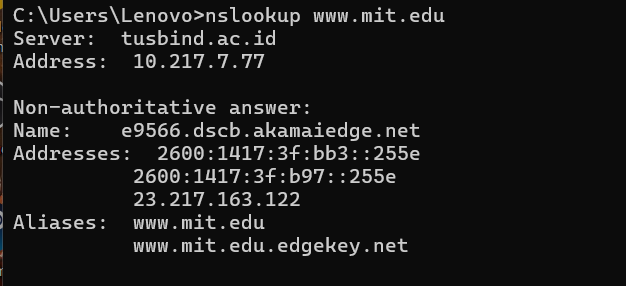  
  
Selanjutnya akan mengimplementasikan perintah **-type=NS** pada domain **mit.edu** ketik **nslookup –type=NS mit.edu**. disini akan menyebabkan nslookup mengirimkan permintaan untuk record tipe-NS ke default server DNS lokal.  
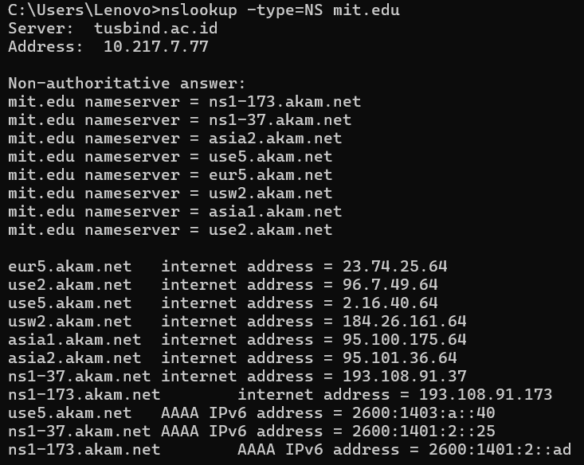  
  
Selanjutnya ketik perintah **nslookup www.aiit.or.kr bitsy.mit.edu** karena kita ingin permintaan dikirim ke server DNS bitsy.mit.edu. Dengan demikian, pertukaran informasi akan terjadi secara langsung antara host yang mengajukan permintaan dan bitsy.mit.edu. Dalam contoh ini, server DNS bitsy.mit.edu memberikan alamat IP dari host www.aiit.or.kr yang merupakan server web di Advanced Institute of Information Technology (di Korea).  
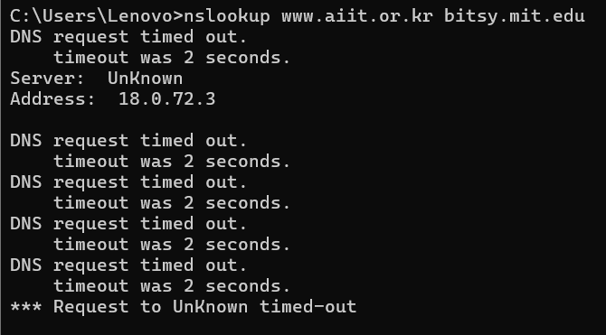  
  
Selanjutnya ketk perintah **nslookup –option1 –option2 host-to-find dns-server**, secara umum, nslookup dapat dijalankan dengan nol, satu, dua, atau lebih opsi. Dan seperti yang telah kita lihat pada contoh sebelumnya, pengisian nama dns-server juga bersifat opsional; jika tidak diisi, permintaan akan dikirim ke default server DNS lokal.  
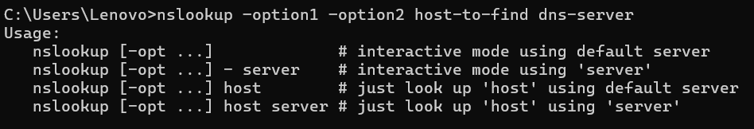  
  
### Pertanyaan
1. Jalankan nslookup untuk mendapatkan alamat IP dari server web di Asia. Berapa alamat IP server tersebut?
2. Jalankan nslookup agar dapat mengetahui server DNS otoritatif untuk universitas di Eropa.
3. Jalankan nslookup untuk mencari tahu informasi mengenai server email dari Yahoo! Mail melalui salah satu server yang didapatkan di pertanyaan nomor 2. Apa alamat IP-nya?
  
### Jawaban
1. Saya menjalankan perintah **nslookup www.tokopedia.com** lalu hasilnya adalah untuk IP global adalah '**23.222.26.57**' dan untuk IP lokal adalah **118.98.95.80**. sementara **118.98.44.10** merupakan alamat IP dari router lokal yang bertindak sebagai DNS resolver.  
  
  
2. Jalankan perintah **nslookup -type=NS cam.ac.uk**, disini kita menggunakan **-type=ns** untuk melihat server mana yang memegang otoritas.  
  
  
3. Jalankan perintah **nslookup -type=MX yahoo.com auth0.dns.cam.ac.uk**, muncul **Query refused** dimana server DNS otoritatif Universitas Cambridge (auth0.dns.cam.ac.uk) hanya melayani query untuk domain miliknya sendiri (cam.ac.uk). Server ini tidak boleh digunakan untuk query domain luar (seperti yahoo.com) jadi kita menggunakan DNS publik seperti Google, kita jalankan **nslookup -type=MX yahoo.com 8.8.8.8**.  
  
  
## 4.3 Ipconfig
  
Ipconfig dapat digunakan untuk menampilkan informasi mengenai TCP/IP Anda saat ini, termasuk alamat IP Anda, alamat server DNS, jenis adaptor, dan sebagainya. Sebagai contoh, kita dapat memperoleh semua informasi tentang host Anda hanya dengan memasukkan perintah **ipconfig /all**.  
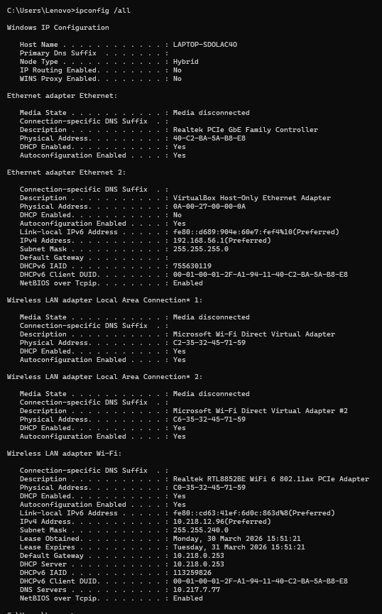  
  
Misal kita ingin menyimpan hasil **ipconfig /all** ke dalam file.txt, kita hanya perlu menmabahkan "> nama_file.txt". Kita jalankan perintah **ipconfig /all > networkinfo.txt**.  
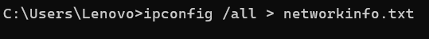  
Kita buka File Explorer, lalu masuk ke folder yang sama dengan folder saat kita menjalankan perintah **ipconfig /all > networkinfo.txt** di Command Prompt. Disana kita akan menemukan file tersebut.  
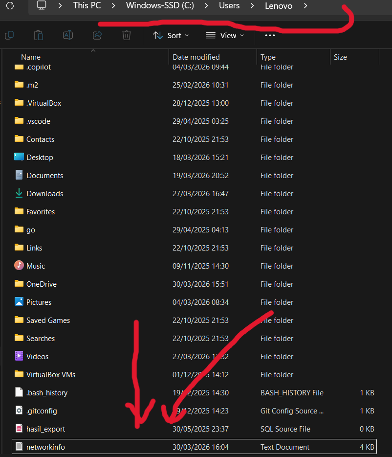  
Ini adalah tampilan ketika filenya dibuka.  
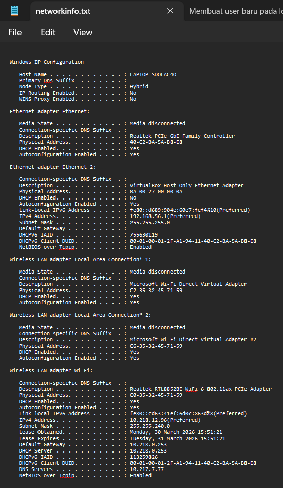  
  
Selanjutnya untuk melihat record yang telah disimpan, ketik perintah **ipconfig /displaydns**.  
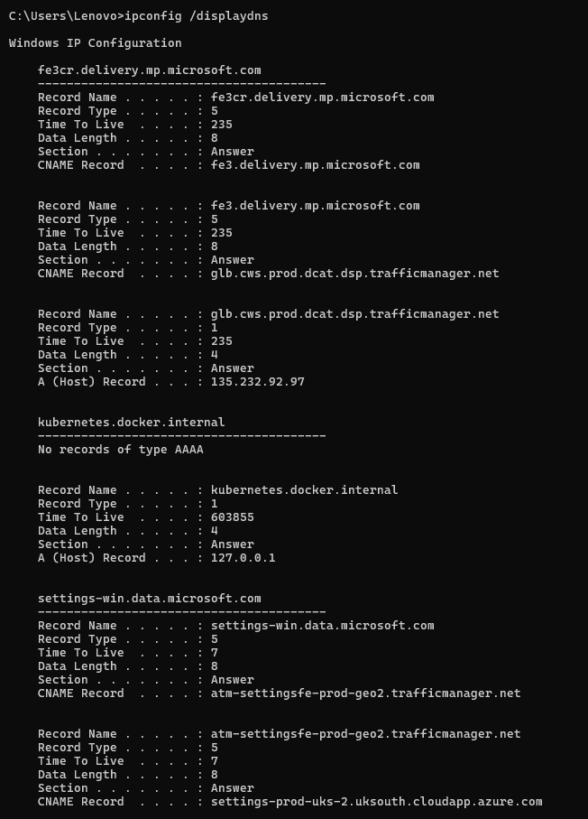  
  
Hasil yang didapatkan akan menampilkan record dan sisa Time To Live (TTL) dalam satuan detik. Untuk menghapus cacatan, masukkan:  
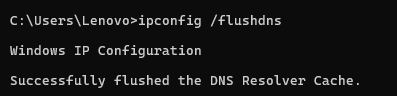  
  
## 4.4 Tracing DNS dengan Wireshark
  
Selanjutnya jalankan perintah **ipconfig** lalu salin IP Adress kita lalu buka wireshark.  
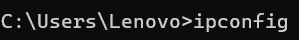  
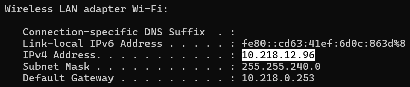  
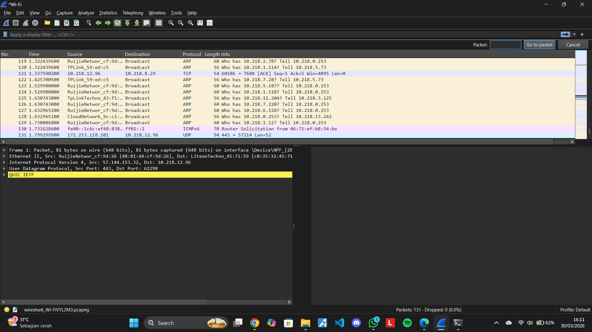  
  
Masukkan filter pada search filter yaitu sesuai arahan **ip.addr == 10.218.12.96**. filter yang digunakan ini akan menghapus semua paket yang tidak berasal atau ditujukan ke host. kegiatan ini sekaligus akan melakukan pengambilan paket di Wireshark.  
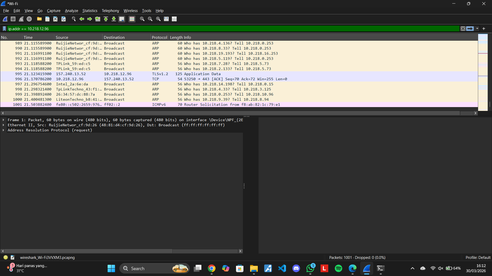  
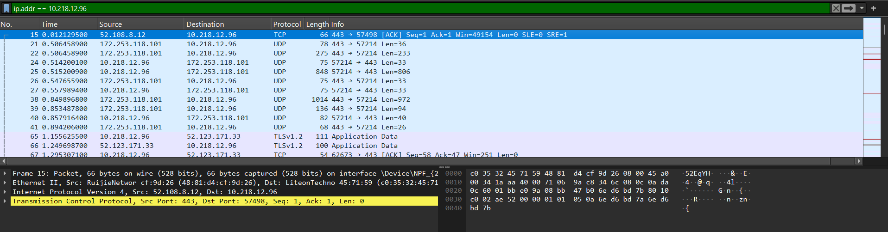  
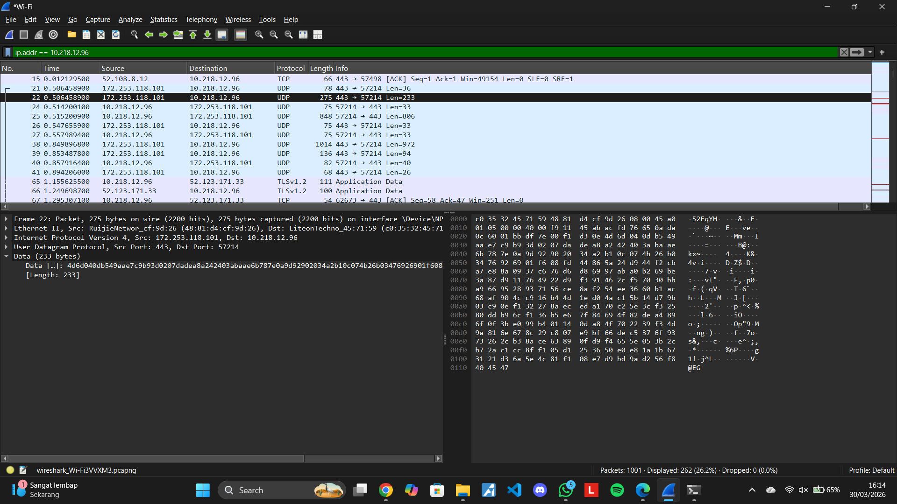  
  
Selanjutnya mengunjungi alamat sesuai arahan modul yaitu www.ietf.org dan selanjutnya menghentikan pengambilan paket pada wireshark.  
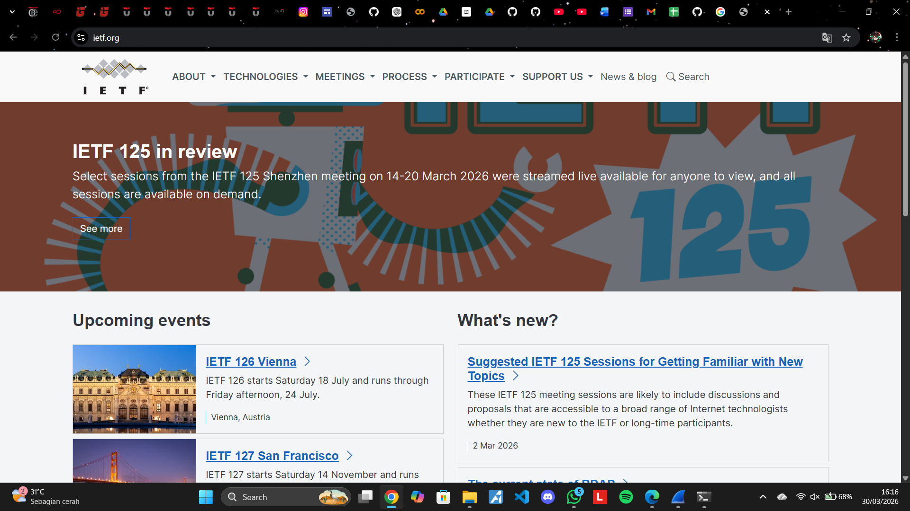  
  
Tambahkan filter **ip.addr == 10.218.12.96 && dns.qry.name contains "ietf"**.  
  
  
### Pertanyaan
1. Cari pesan permintaan DNS dan balasannya. Apakah pesan tersebut dikirimkan melalui UDP atau TCP?
2. Apa port tujuan pada pesan permintaan DNS? Apa port sumber pada pesan balasannya?
3. Pada pesan permintaan DNS, apa alamat IP tujuannya? Apa alamat IP server DNS lokal anda (gunakan ipconfig untuk mencari tahu)? Apakah kedua alamat IP tersebut sama?
4. Periksa pesan permintaan DNS. Apa “jenis” atau ”type” dari pesan tersebut? Apakah pesan permintaan tersebut mengandung ”jawaban” atau ”answers”?
5. Periksa pesan balasan DNS. Berapa banyak ”jawaban” atau ”answers” yang terdapat di dalamnya? Apa saja isi yang terkandung dalam setiap jawaban tersebut?
6. Perhatikan paket TCP SYN yang selanjutnya dikirimkan oleh host Anda. Apakah alamat IP pada paket tersebut sesuai dengan alamat IP yang tertera pada pesan balasan DNS?
7. Halaman web yang sebelumnya anda akses (http://www.ietf.org) memuat beberapa gambar. Apakah host Anda perlu mengirimkan pesan permintaan DNS baru setiap kali ingin mengakses suatu gambar?
  
### Jawaban
1. Jadi pesan yang dikirimkan melalui UDP yang berisikan 30 bytes.  
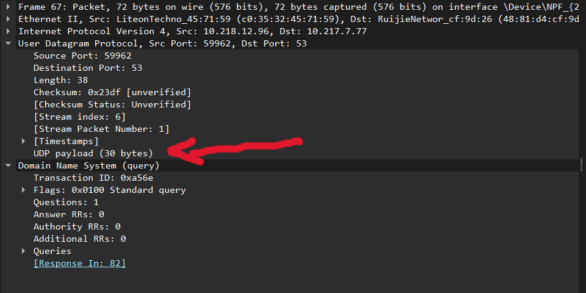  
  
2. Jadi port tujuan yang diberikan adalah 59962 dengan sumber port yang diberikan yaitu 53.  
  
  
3. Jadi alamat IP tujuannya adalah 10.217.7.77, alamat IP server DNS lokal saya adalah 10.217.7.77. Jadi kesimpulannya adalah kedua alamat IP tersebut sama.  
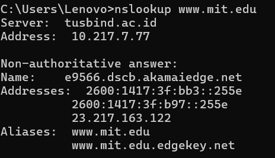  
  
  
4. Type: A (IPv4) dan juga AAAA (IPv6), iya mengandung answer.  
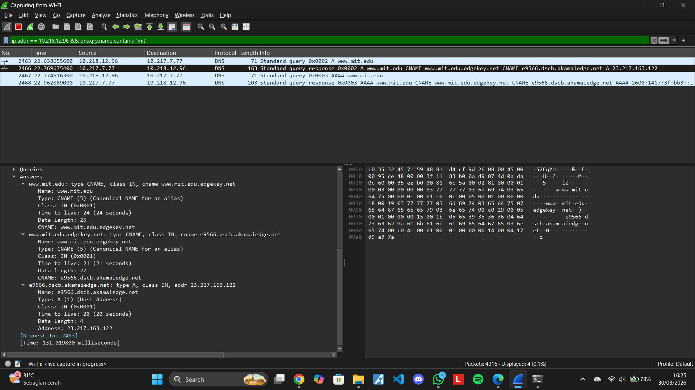  
  
5. Ada 3 jawaban dan 4 jawaban, isi yang terkandung diantaranya Name, Type, Class, Time to Live(ttl), Data length, dan CNAME.  
  
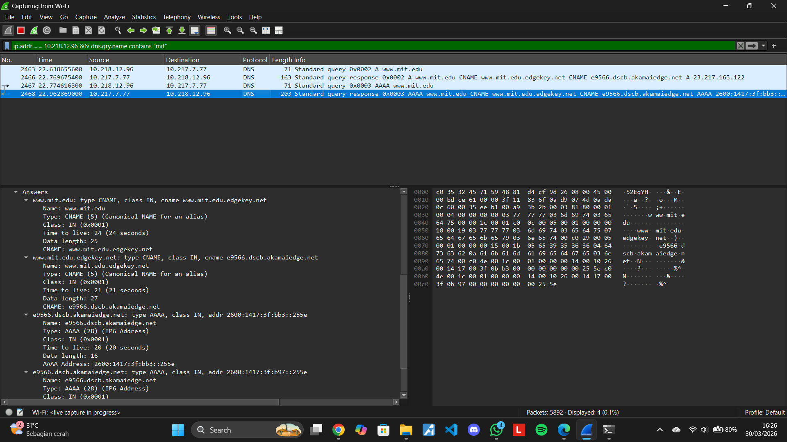  
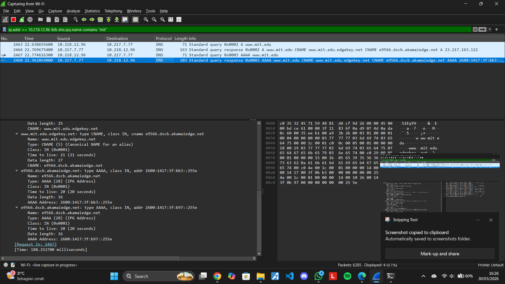  
  
6. Iya sudah sesuai karena sebelumnya pada saat melakukan pengecekan melalui nslookup alamat 20.189.173.27 adalah salah satu dari Addresses yang diberikan oleh server DNS.  
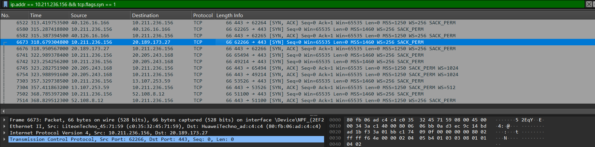  
  
7. Tidak, tidak selalu perlu mengirim permintaan DNS baru setiap kali mengakses gambar dari http://www.ietf.org. karena browser melakukan DNS lookup untuk mendaptakan alamat IP lalu disimpan di cache.  
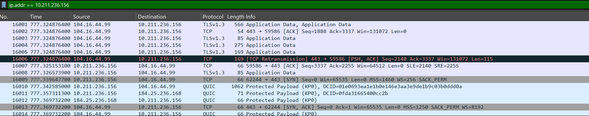  
  
Selanjutnya jawablah pertanyaan-pertanyaan di bawah. Dalam menjawab pertanyaan, abaikan dua pasangan permintaan-balasan pertama karena mereka merupakan paket yang khusus dihasilkan oleh nslookup. Anda cukup fokus pada pesan permintaan dan balasan terakhir.  
  
### Pertanyaan
1. Apa port tujuan pada pesan permintaan DNS? Apa port sumber pada pesan balasan DNS?
2. Ke alamat IP manakah pesan permintaan DNS dikirimkan? Apakah alamat IP tersebut merupakan default alamat IP server DNS lokal Anda?
3. Periksa pesan permintaan DNS. Apa ”jenis” atau ”type” dari pesan tersebut? Apakah pesan tersebut mengandung ”jawaban” atau ”answers”?
4. Periksa pesan balasan DNS. Berapa banyak ”jawaban” atau “answers” yang terdapat di dalamnya. Apa saja isi yang terkandung dalam setiap jawaban tersebut?
5. Sertakan hasil tangkapan layar.
  
### Jawaban
1. Iya, keduanya yaitu dari port tujuan dan juga port sumber pada pesan balasan yaitu 53.  
  
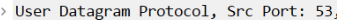  
  
2. Alamat IP untuk yang dituju dari permintaan adalah 10.217.7.77 disini alamat IP tidak sama dengan server dns lokal karena harus lewat berbagai dns termasuk ISP sendiri.  
  
  
3. Type: A (IPv4) dan juga AAAA (IPv6), iya mengandung answer.  
  
  
4. Ada 3 jawaban dan 4 jawaban, isi yang terkandung diantaranya Name, Type, Class, Time to Live(ttl), Data length, dan CNAME.  
  
  
  
  
Sekarang, ulangi percobaan sebelumnya, namun gunakan perintah: **nslookup –type=NS mit.edu**.  
  
### Pertanyaan
1. Ke alamat IP manakah pesan permintaan DNS dikirimkan? Apakah alamat IP tersebut merupakan default alamat IP server DNS lokal Anda?
2. Periksa pesan permintaan DNS. Apa ”jenis” atau ”type” dari pesan tersebut? Apakah pesan tersebut mengandung ”jawaban” atau ”answers”?
3. Periksa pesan balasan DNS. Apa nama server MIT yang diberikan oleh pesan balasan? Apakah pesan balasan ini juga memberikan alamat IP untuk server MIT tersebut?
4. Sertakan hasil tangkapan layar.
  
### jawaban
1. Dikirim ke 10.217.7.77.  
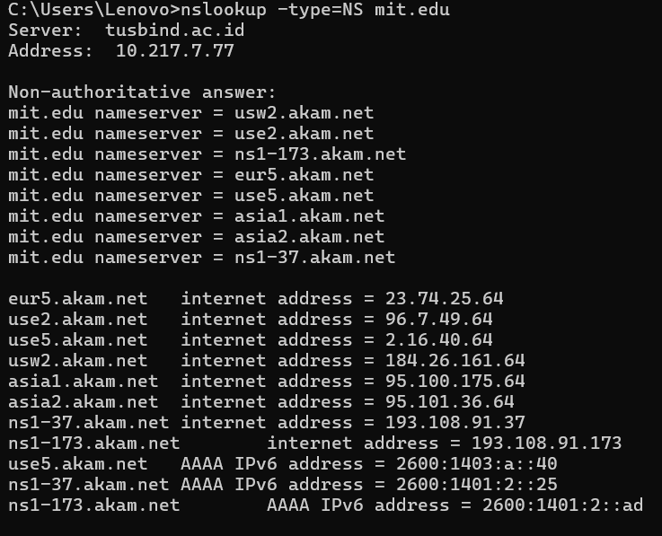  
  
2. Standard query 0x0002 NS mit.edu, jadi tipenya adalah NS, iya mengandung asnwer.  
  
  
3. Ada beberapa bisa dilihat pada gamabr dibawah, iya menyertakan alamat IP untuk server MIT.  
  
  
   
Sekarang, ulangi percobaan sebelumnya, namun gunakan perintah: **nslookup www.aiit.or.kr bitsy.mit.edu**  
  
### Pertanyaan
1. Ke alamat IP manakah pesan permintaan DNS dikirimkan? Apakah alamat IP tersebut merupakan default alamat IP server DNS lokal Anda?
2. Periksa pesan permintaan DNS. Apa ”jenis” atau ”type” dari pesan tersebut? Apakah pesan tersebut mengandung ”jawaban” atau ”answers”? 
3. Periksa pesan balasan DNS. Berapa banyak ”jawaban” atau “answers” yang terdapat di dalamnya. Apa saja isi yang terkandung dalam setiap jawaban tersebut?
4. Sertakan hasil tangkapan layar.
  
### jawaban
1. Dikirim ke alamat IP 18.0.72.3, yang merupakan alamat IP dari server DNS bitsy.mit.edu.  
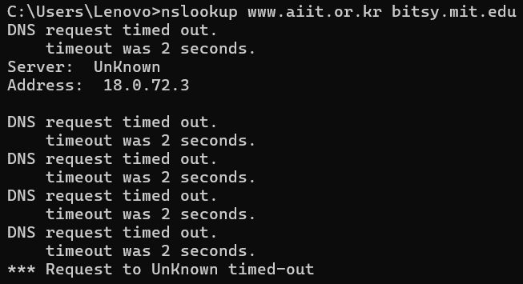  
  
2. Tidak ada jawaban yang diberikan pada permintaan DNS.  
  
3. Pesan balasan DNS tidak diterima karena terjadi timeout pada server DNS yang digunakan.  
  
  

----------------------------------------------------------------------------------------------------------------------------------
  
## Langkah-langkah Modul 5

## UDP
>Di modul ini, kita akan melihat sekilas protokol transport UDP. UDP adalah protokol yang senderhana dan tidak rumit. UDP merupakan protokol dari IPS atau biasa disebut dengan Internet Protocol Suite yang digunakan untuk mengirimkan data di jaringan komputer. karakteristiknya yaitu UDP tidak melakukan handshake, ia akan langsung mengirimkan data ke alamat tujuan tanpa mengetahui apakah penerima sudah siap atau belum.  
  
----------------------------------------------------------------------------------------------------------------------------------
  
## 5.2 Tugas
  
1. Pilih satu paket UDP yang terdapat pada trace Anda. Dari paket tersebut, berapa banyak “field” yang terdapat pada header UDP? Sebutkan nama-nama field yang Anda temukan!
2. Perhatikan informasi “content field” pada paket yang Anda pilih di pertanyaan 1. Berapa panjang (dalam satuan byte) masing-masing “field” yang terdapat pada header UDP?
3. Nilai yang tertera pada ”Length” menyatakan nilai apa? Verfikasi jawaban Anda melalui paket UDP pada trace.
4. Berapa jumlah maksimum byte yang dapat disertakan dalam payload UDP? (Petunjuk: jawaban untuk pertanyaan ini dapat ditentukan dari jawaban Anda untuk pertanyaan 2)
5. Berapa nomor port terbesar yang dapat menjadi port sumber? (Petunjuk: lihat petunjuk pada pertanyaan 4)
6. Berapa nomor protokol untuk UDP? Berikan jawaban Anda dalam notasi heksadesimal dan desimal. Untuk menjawab pertanyaan ini, Anda harus melihat ke bagian ”Protocol” pada datagram IP yang mengandung segmen UDP.
7. Periksa pasangan paket UDP di mana host Anda mengirimkan paket UDP pertama dan paket UDP kedua merupakan balasan dari paket UDP yang pertama. (Petunjuk: agar paket kedua merupakan balasan dari paket pertama, pengirim paket pertama harus menjadi tujuan dari paket kedua). Jelaskan hubungan antara nomor port pada kedua paket tersebut.
  
## Jawaban

### Langkah-langkah trace
Cari folder wireshark-trace yang sudah kita download di File Explorer.  
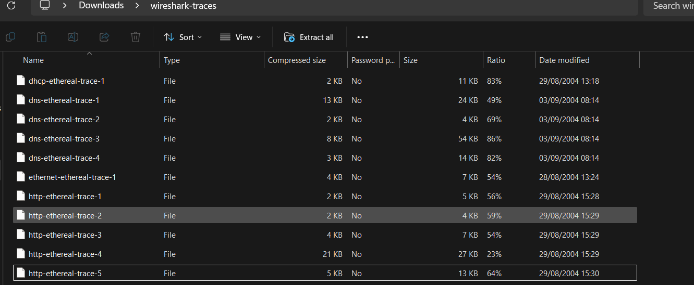  
  
Lalu klik kanan dan klik **open**, lalu klik wireshark dan klik **just once**.  
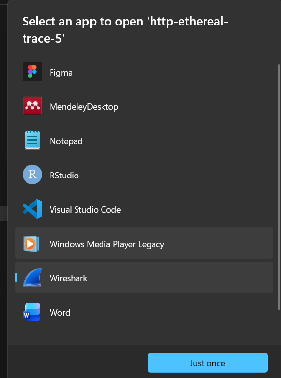  
  
Lalu tampilan wireshark kalian akan seperti ini:  
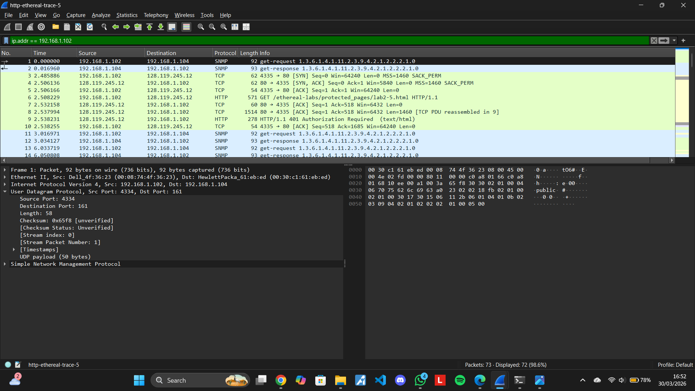  
  
1. Jadi terlihat pada gambar ada 4 field utama di header UDP yaitu Source Port: 4334, Destination Port: 161, length: 58 byte, dan checksum: 0x65f8.  
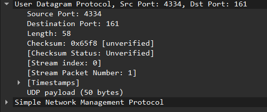  
  
2. Untuk setiap field berukuran 2 bytes dan panjang bitnya adalah 16 jika ditotal untuk byte adalah 8 byte.  
  
  
3. Jadi nilai Length = panjang total UDP header + payload/data (dalam bytes). Verifikasi = Length = 8 (header, didapat dari no 2) + jumlah byte data = 58 bytes, sehingga jumlah data yang dapat ditampung adalah 50 byte saja (8 byte terpakai pada header).  
  
  
4. Total length pada header UDP = 16 bit(did apat dari no 2), nilai maksimum yang dapat direpresentasikan oleh 16 bit adalah (216 - 1) = 65535. Untuk jumlah maksimum payload = maximum payload = 65.535 - 8 = 65.527 byte. jadi maximum byte di payload udp adalah 65.527 byte.  
  
  
5. Field Source Port memiliki panjang 2 byte atau 16 bit. maka nomor port terbesar yang bisa digunakan sebagai port sumber adalah 65.535. sesuai dengan (216 − 1) = 65.535.  
  
  
6. Pada bagian ”Protocol” di datagram IP yang mengandung segmen UDP. Nomor protokol UDPnya adalah 17 atau 0x11 dalam bentuk heksadesimal.  
  
  
7. Dapat dilihat disini bahwa kedua paket memiliki nomor tujuan dan pengiriman yang sesuai dengan satu sama lain. Paket pertama Source port = 4334 Dest port = 161 Paket kedua Source port = 161 Dest port = 4334, dimana terjadi proses pemgiriman dan membalas begitu juga sebaliknya.  
  