# Laporan praktikun 5 - 6, April 2026
  
| Field       | Data                 |
|-------------|----------------------|
| Nama        | Bima Luthfi Nurhakim |
| Nim         | 103072400030         |
| Kelas       | IF-04-05             |
| Mata Kuliah | Jaringan Komputer    |
  
  
## Tujuan Laprak:
- Modul 6: Mahasiswa dapat menginvestigasi cara kerja protokol TCP menggunakan Wireshark  
  
----------------------------------------------------------------------------------------------------------------------------------
  
## 6.1 Pengantar
Pada modul ini, kita akan mempelajari protokol yang terkenal yaitu TCP secara mendetail. Kita akan menganalisis trace atau jejak segmen TCP yang dikirim dan diterima ketika terjadi transaksi pengiriman file dengan ukuran 150 KB (berisi teks Alice’s Adventures in Wonderland karya Lewis Carrol) dari komputer Anda ke server jarak jauh. Kita akan mempelajari penggunaan nomor urutan dan acknowledgement TCP untuk memfasilitasi proses transfer data yang terpercaya; kita akan melihat algoritma “congestion control” TCP –mulai bekerja secara lambat dan menghindari kemacetan- beraksi; dan kita akan melihat mekanisme “flow control” yang disarankan oleh penerima TCP. Kita juga akan membahas secara singkat pengaturan koneksi TCP serta menyelidiki performa (throughput dan round-trip time) koneksi TCP antara komputer Anda dan server.  
  
----------------------------------------------------------------------------------------------------------------------------------
  
## Langkah-langkah Modul 6
  
## 6.2 Menangkap Tansfer TCP dalam Jumlah Besar dari Komputer Pribadi ke Remote Server
  
Buka browser dan unduh file alice.txt melalui URL berikut:  
[link alice.txt](http://gaia.cs.umass.edu/wireshark-labs/alice.txt)  
  
Tampilan websitenya akan sperti ini.  
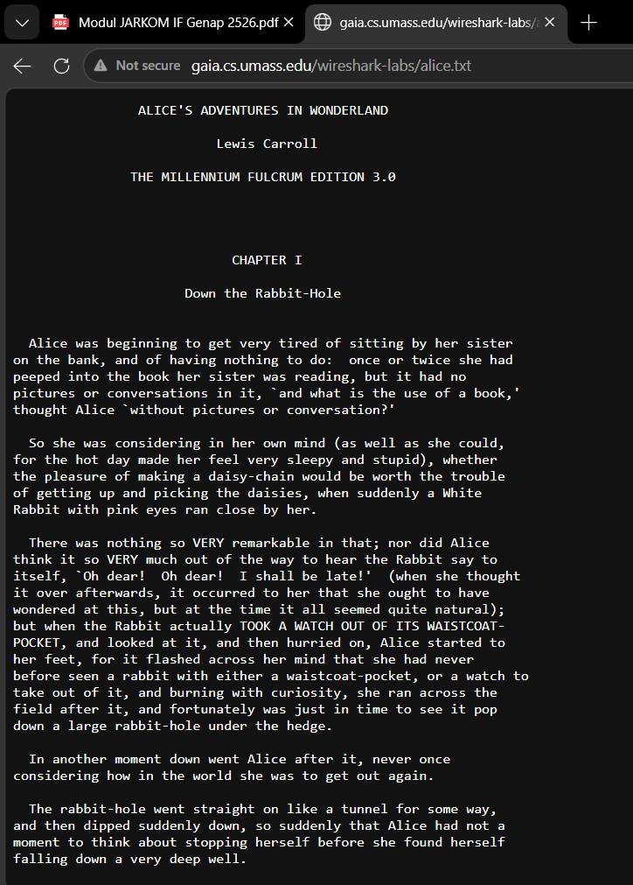  
  
Kemudian simpan file tersebut.  
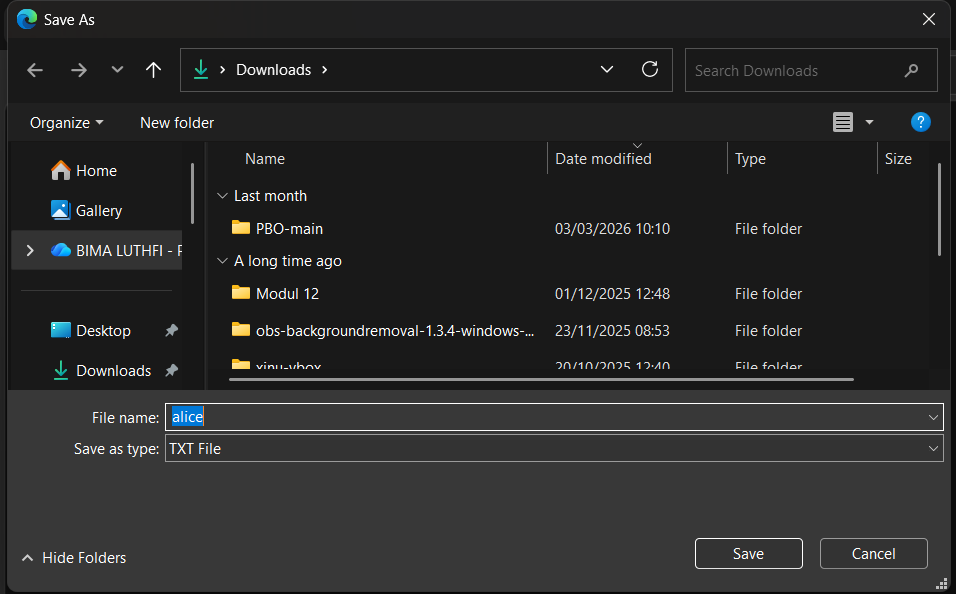  
  
Kemdian buka URL dibawah ini:  
[link alice.txt](http://gaia.cs.umass.edu/wireshark-labs/TCP-wireshark-file1.html)  
  
Tampilan websitenya akan sperti ini.  
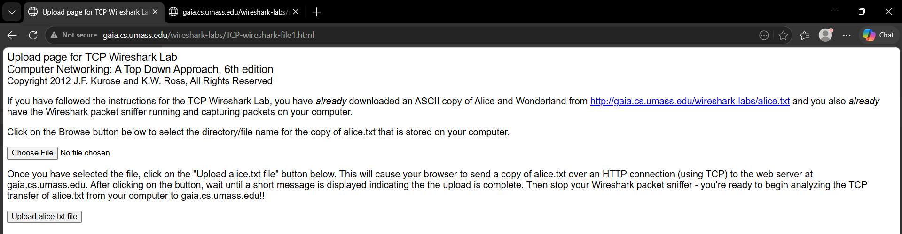  
  
Upload file alice.txt tapi ditahan dulu.  
  
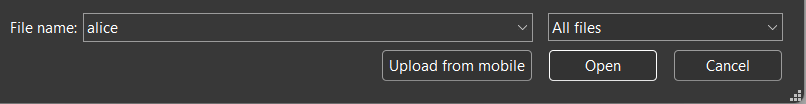  
  
Kemudian buka wireshark, pilih capture WIFI.  
  
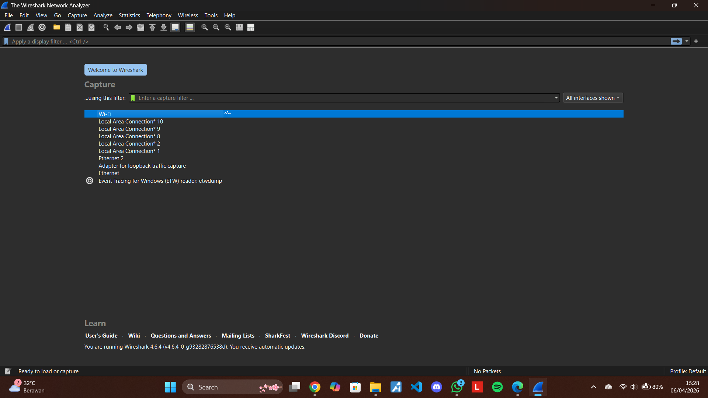  
  
Lalu pindah ke browser kembali dan klik **Upload file alice.txt**.  
  
  
Website akan merespon dengan menampilkan seperti dibawah ini:  
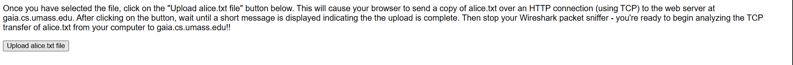  
  
Lalu pindah ke wireshark.  
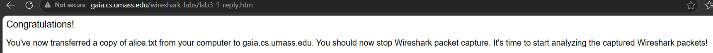  
  
----------------------------------------------------------------------------------------------------------------------------------
  
## 6.3 Tampilan Awal pada Captured Trace
  
Lalu lakukan filter "tcp".  
  
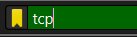  
  
### Pertanyaan
1. Berapa alamat IP dan nomor port TCP yang digunakan oleh komputer klien (sumber) untuk mentransfer file ke gaia.cs.umass.edu? Cara paling mudah menjawab pertanyaan ini adalah dengan memilih sebuah pesan HTTP dan meneliti detail paket TCP yang digunakan untuk membawa pesan HTTP tersebut.
2. Apa alamat IP dari gaia.cs.umass.edu? Pada nomor port berapa ia mengirim dan menerima 
segmen TCP untuk koneksi ini?
  
Jika Anda telah membuat trace Anda sendiri, jawab pertanyaan berikut:  
  
3. Berapa alamat IP dan nomor port TCP yang digunakan oleh komputer klien Anda (sumber) 
untuk mentransfer  ke gaia.cs.umass.edu?
  
### jawaban
1. Pertama cari pesan "HTTP" dengan menfilter "HTTP" atau bisa gulir ke bawah sampai ketemu.  
Cara filter:  
  
  
Cara gulir:  
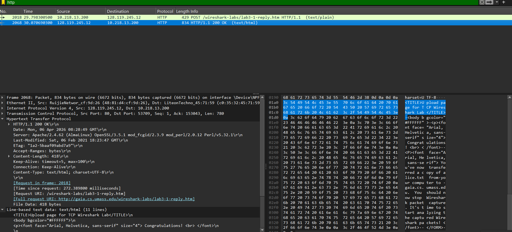  
  
Dengan memilih pesan HTTP dan melihat paket TCP yang digunakan untuk membawa pesan HTTP tersebut. Jadi IP-nya adalah 10.218.13.200 dan nomor port sumber adalah 53709.  
  
2. Jadi server gaia.cs.umass.edu menggunakan alamat IP-nya adalah 128.119.245.12 dan nomor portnya adalah 80.  
  
  
3. Pertama buka Command Prompt.  
  
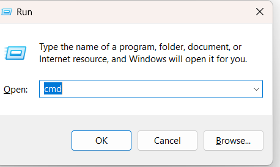  
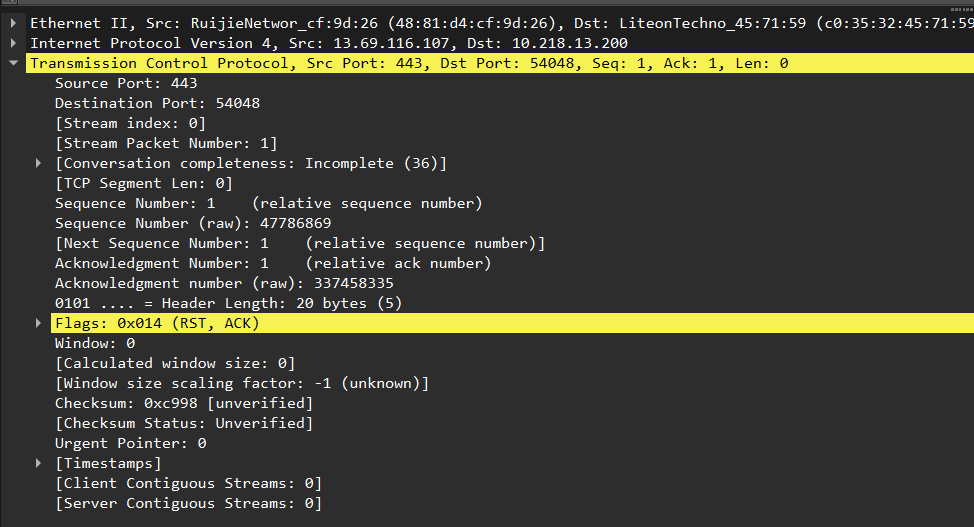  
  
  
Jadi alamat IPnya adalah 10.217.7.77 dan port yang digunakan adalah 53709.  
  
----------------------------------------------------------------------------------------------------------------------------------
  
## 6.4 Dasar TCP
  
Pertama buka trace 1 di wire shark.  
  
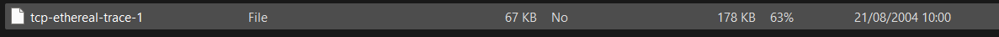  
  
### Pertanyaan
1. Berapa nomor urut segmen TCP SYN yang digunakan untuk memulai sambungan TCP antara komputer klien dan gaia.cs.umass.edu? Apa yang dimiliki segmen tersebut sehingga teridentifikasi sebagai segmen SYN?
2. Berapa nomor urut segmen SYNACK yang dikirim oleh gaia.cs.umass.edu ke komputer klien sebagai balasan dari SYN? Berapa nilai dari field Acknowledgement pada segmen SYNACK? Bagaimana gaia.cs.umass.edu menentukan nilai tersebut? Apa yang dimiliki oleh segmen sehingga teridentifikasi sebagai segmen SYNACK?
3. Berapa nomor urut segmen TCP yang berisi perintah HTTP POST? Perhatikan bahwa untuk menemukan perintah POST, Anda harus menelusuri content field milik paket di bagian bawah jendela Wireshark, kemudian cari segmen yang berisi "POST" di bagian field DATAnya.
4. Anggap segmen TCP yang berisi HTTP POST sebagai segmen pertama dalam koneksi TCP. Berapa nomor urut dari enam segmen pertama dalam TCP (termasuk segmen yang berisi HTTP POST)? Pada jam berapa setiap segmen dikirim? Kapan ACK untuk setiap segmen diterima? Dengan adanya perbedaan antara kapan setiap segmen TCP dikirim dan kapan acknowledgement-nya diterima, berapakah nilai RTT untuk keenam segmen tersebut? Berapa nilai EstimatedRTT setelah penerimaan setiap ACK? (Catatan: Wireshark memiliki fitur yang memungkinkan Anda untuk memplot RTT untuk setiap segmen TCP yang dikirim. Pilih segmen TCP yang dikirim dari klien ke server gaia.cs.umass.edu pada jendela "daftar paket yang ditangkap". Kemudian pilih: Statistics->TCP Stream Graph- >Round Trip Time 
Graph).
5. Berapa panjang setiap enam segmen TCP pertama?
6. Berapa jumlah minimum ruang buffer tersedia yang disarankan kepada penerima dan diterima untuk seluruh trace? Apakah kurangnya ruang buffer penerima pernah menghambat pengiriman?
7. Apakah ada segmen yang ditransmisikan ulang dalam file trace? Apa yang anda periksa (di dalam file trace) untuk menjawab pertanyaan ini?
8. Berapa banyak data yang biasanya diakui oleh penerima dalam ACK? Dapatkah anda mengidentifikasi kasus-kasus di mana penerima melakukan ACK untuk setiap segmen yang diterima?
9. Berapa throughput (byte yang ditransfer per satuan waktu) untuk sambungan TCP? Jelaskan bagaimana Anda menghitung nilai ini.
  
### Jawaban
1. Pertama lakukan filter tcp.flags.syn == 1 && tcp.flags.syn == 0.  
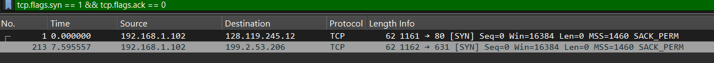  
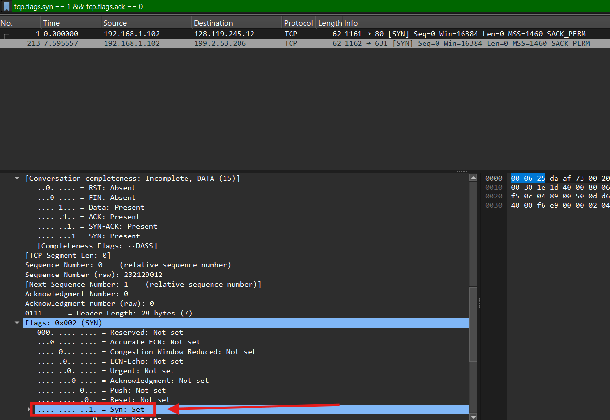  
  
ini merupakan *three-way handshake*.  
  
2. Pertama lakukan filter tcp.flags.syn == 1 && tcp.flags.syn == 1.  
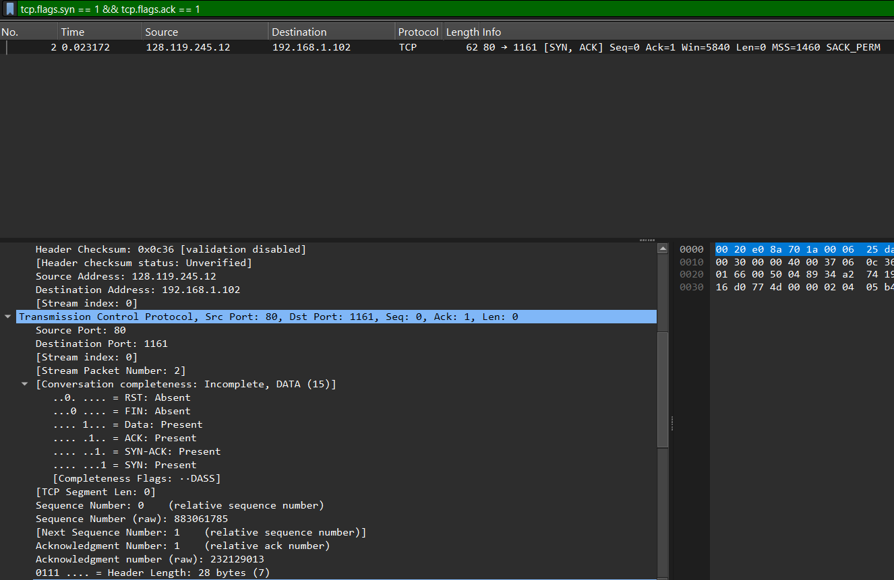  
  
- Jadi nomor urut segmen SYN-ACK yang dikirim ke klien adalah 0. Nilai field Acknowledgement pada segmen SYN-ACK adalah 1. Caranya adalah nilai Acknowledgement dihitung dari nomor urut segmen SYN yang diterima dari komputer klien, segmen SYN dari klien memiliki Sequence Number = 0 (relative)
- Karena flag SYN “mengonsumsi” 1 nomor urut, server mengirim Acknowledgement = 0 + 1 = 1
- ini adalah bagian standar dari TCP three-way handshake: server mengakui penerimaan SYN klien dengan menaikkan nomor urut SYN tersebut sebesar 1.
- Yang membuat segmen ini teridentifikasi sebagai SYN-ACK: segmen memiliki dua flag TCP yang diset (bernilai 1) jadi: SYN = 1, ACK = 1.  
  
3. Pertama lakukan filter tcp.port == 1161 && tcp contains "POST".  
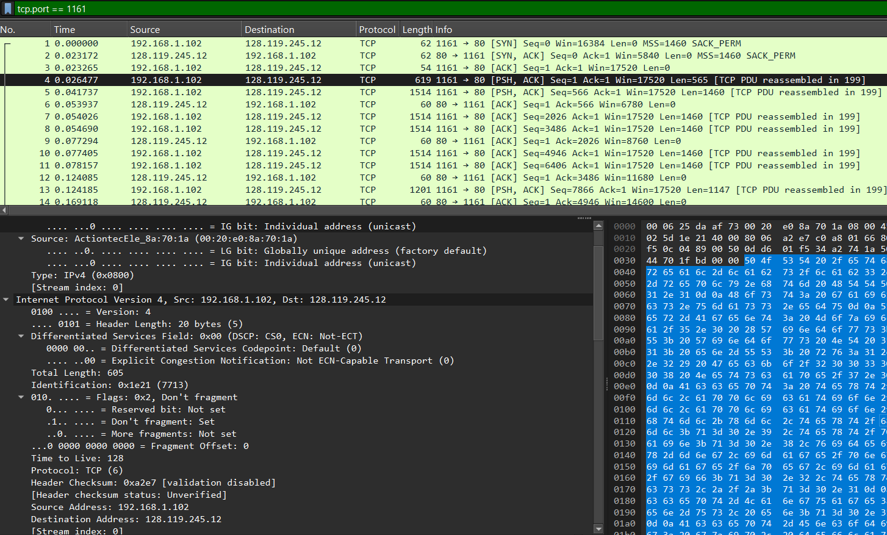  
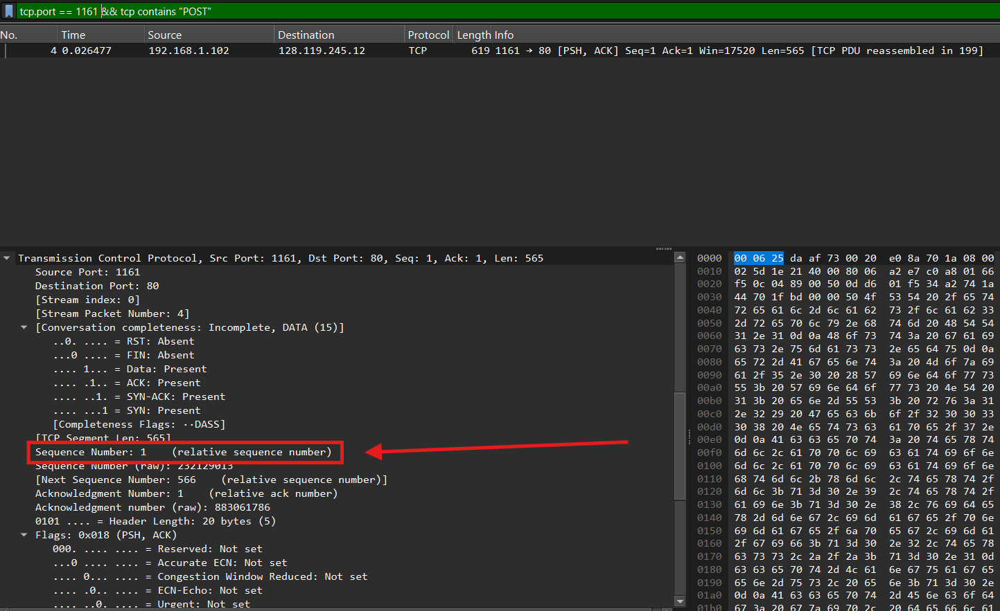  
  
Nomor urut = 199 seperti terlihat pada gambar diatas.  
  
4. Pertama lakukan filter tcp.port == 1161
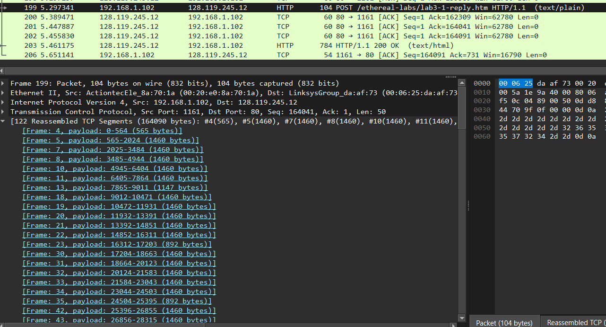  
  
Lalu lihat Reassembled TCP segments di wireshark.  
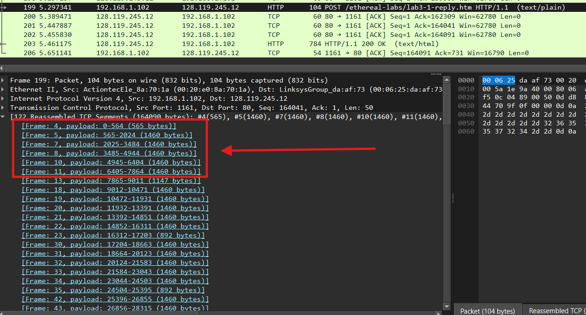  
  
- Jadi enam segmen pertama dalam TCP = 565 + 1460 + 1460 + 1460 + 1460 + 1460 = 7865 segmnets.  
  
----------------------------------------------------------------------------------
Berdasarkan trace, enam segmen pertama yang teridentifikasi adalah:  
Frame 4 (Segmen 1): payload 0–564 (565 bytes), dikirim pada t = 0.026477 s  
Frame 5 (Segmen 2): payload 565–2024 (1460 bytes), dikirim pada t = 0.041737 s  
Frame 7 (Segmen 3): payload 2025–3484 (1460 bytes), dikirim pada t = 0.054026 s  
Frame 8 (Segmen 4): payload 3485–4944 (1460 bytes), dikirim pada t = 0.054690 s  
Frame 10 (Segmen 5): payload 4945–6404 (1460 bytes), dikirim pada t = 0.077405 s  
Frame 11 (Segmen 6): payload 6405–7864 (1460 bytes), dikirim pada t = 0.078157 s  
----------------------------------------------------------------------------------
  
- Nilai RTT diperoleh dari (ACK diterima - segmen dikirim). Berdasarkan grafik RTT yang dihasilkan melalui Statistics → TCP Stream Graph → Round Trip Time Graph, nilai RTT pada awal koneksi berkisar antara 27,5 ms hingga 270 ms, dengan pola yang berfluktuasi secara periodik sepanjang durasi transfer.  
  
Tampilan grafik Round Trip Time (RTT) untuk koneksi TCP ini:  
  
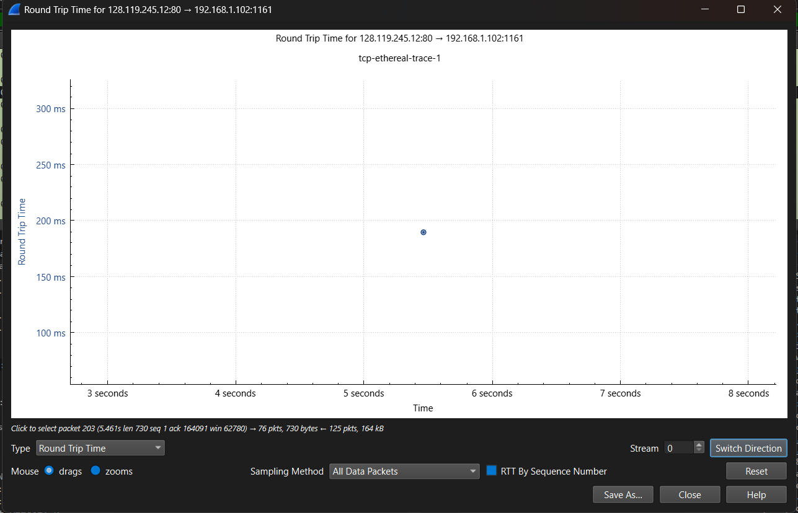  
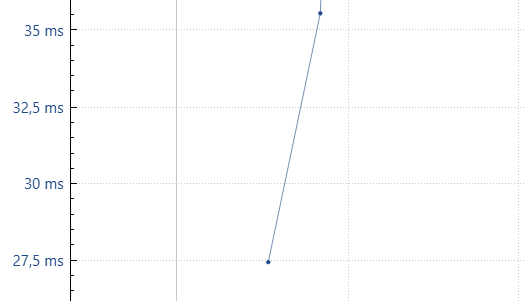  
  
  
5. Panjang masing-masing dari enam segmen TCP pertama adalah sebagai berikut:  
- Frame 4 (Segmen 1): 565 bytes
- Frame 5 (Segmen 2): 1460 bytes
- Frame 7 (Segmen 3): 1460 bytes
- Frame 8 (Segmen 4): 1460 bytes 
- Frame 10 (Segmen 5): 1460 bytes
- Frame 11 (Segmen 6): 1460 bytes
  
  
  
6. Nilai diambil dari window = 5840, tidak pernah menghambat pengiriman karena tidak pernah mencapai 0 window dan tidak ada kejadian zero window atau window full.  
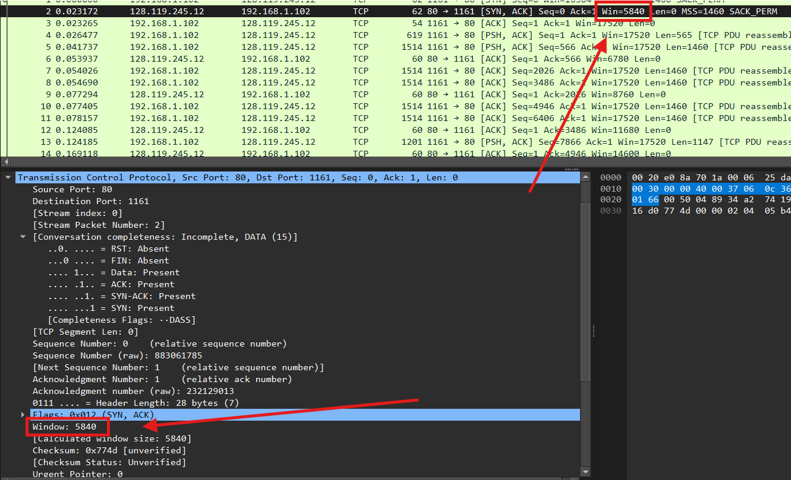  
  
7. Tidak ada segmen yang dikirimkan ulang.  
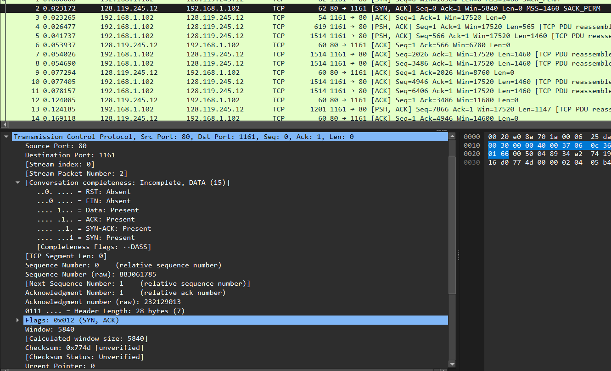  
  
8. Kita ambil contoh nilai ACK-nya yaitu 7866 ke 9013 berarti nilai yang di ACK sekaligus adalah 1147 byte, disini pakai selisih nomor ACK-nya.  
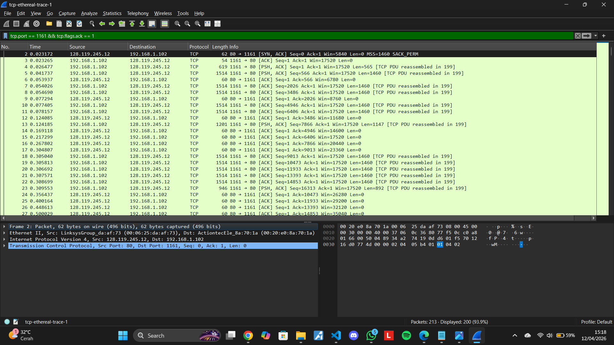  
  
9. Pertama klik **statistics**.  
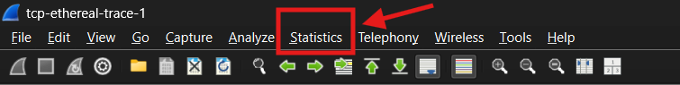  
  
Lalu pilih **TCP Stream Graphs** lalu klik **Throughput**.  
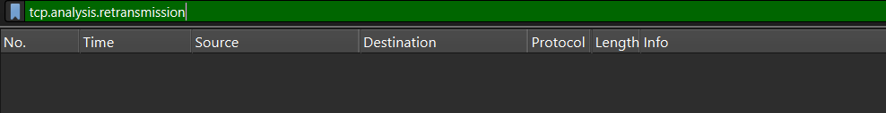  
  
Lalu klik **Switch Direction**.  
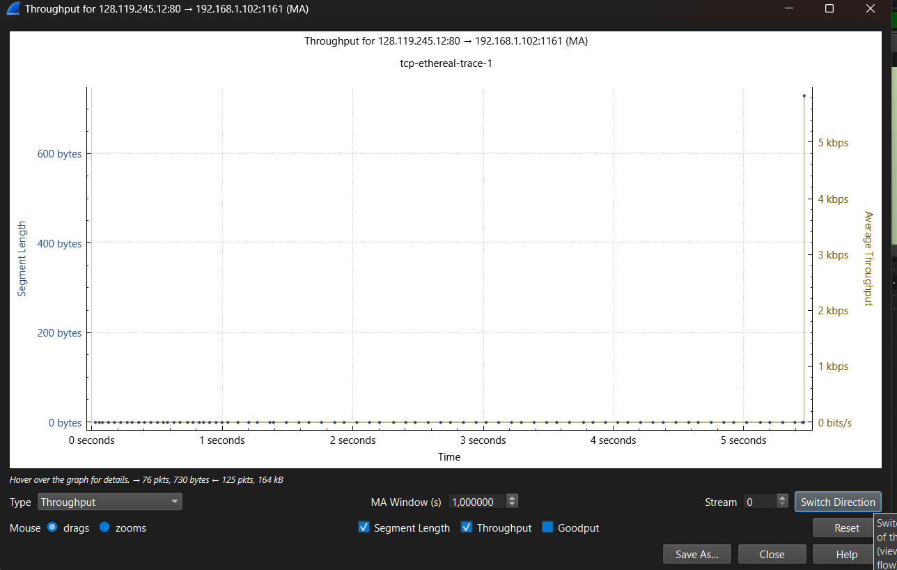  
  
Grafiknya akan muncul sepeerti ini:  
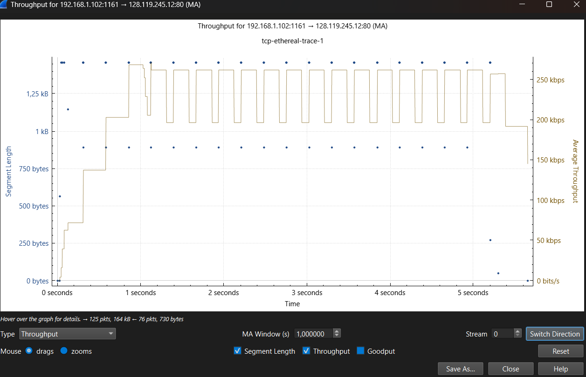  
  
Ini adalah ukuran datanya:  
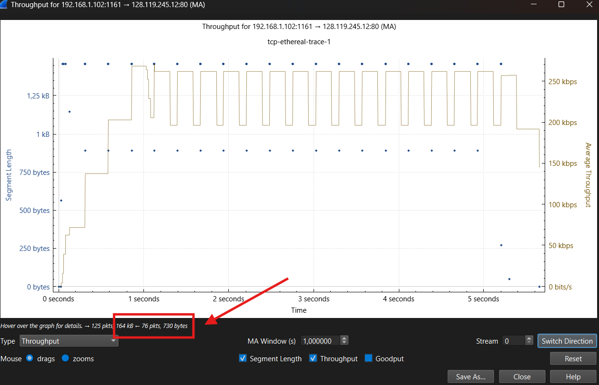  
  
Ini average Throughput:  
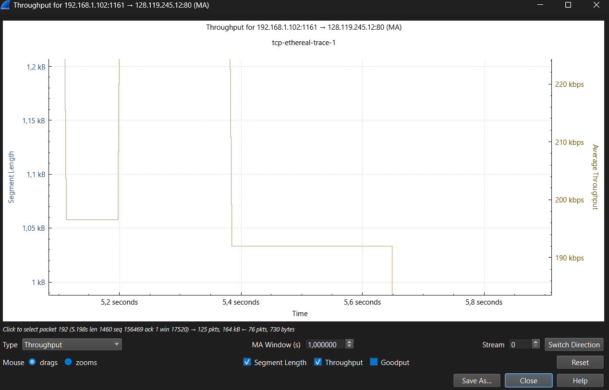  
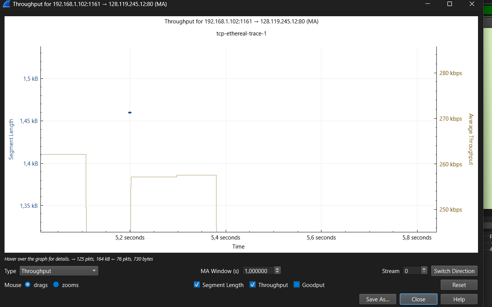  
  
Ini waktu tranfer:  
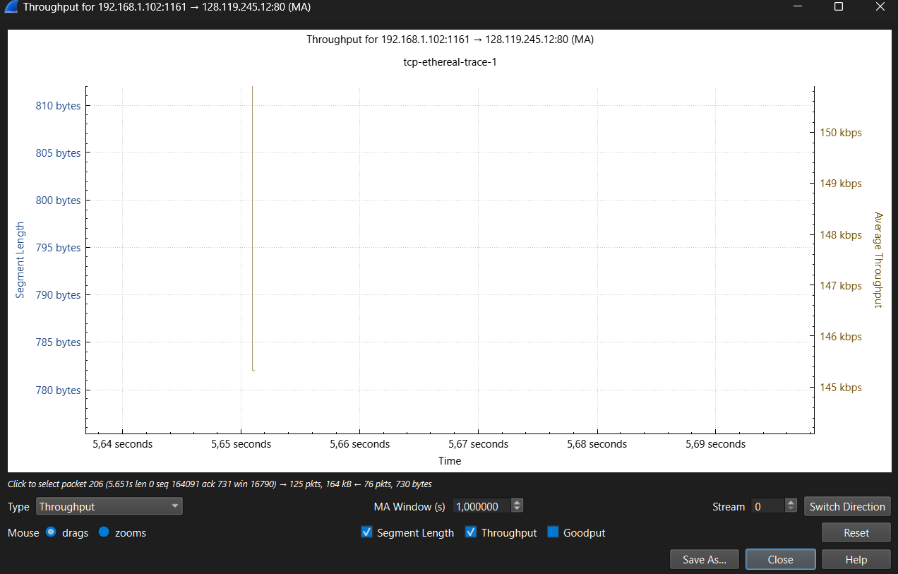  
  
Jadi total data yang dikirim dari klien ke server adalah 164 kB dalam rentang waktu sekitar 5.65 detik. Nilai throughput rata-rata dihitung sebagai berikut:  
  
'''
Throughput = Total Data ÷ Waktu Transfer
           = 164000 bytes ÷ 5,65 detik
           ≈ 28318 bytes/detik
           ≈ 226,5 kbps
'''
  
----------------------------------------------------------------------------------------------------------------------------------
  
## 6.5 Congestion Control pada TCP
  
Pertama klik **statistics**.  
  
  
Lalu pilih **TCP Stream Graphs** lalu klik **Time Sequence (Stevens)**.  
  
  
Lalu klik **Switch Direction**.  
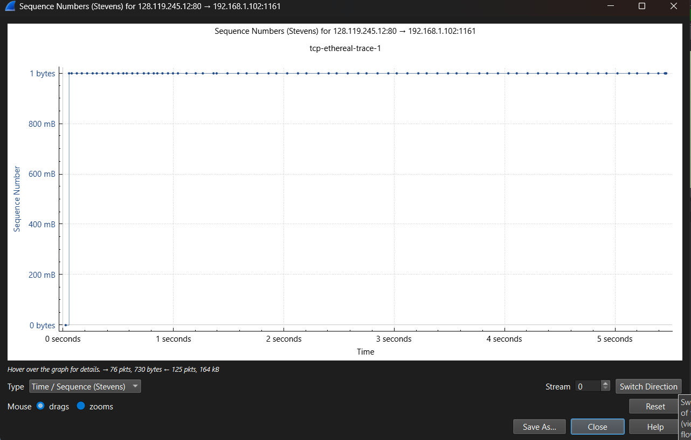  
  
Grafiknya akan muncul sepeerti ini:  
  
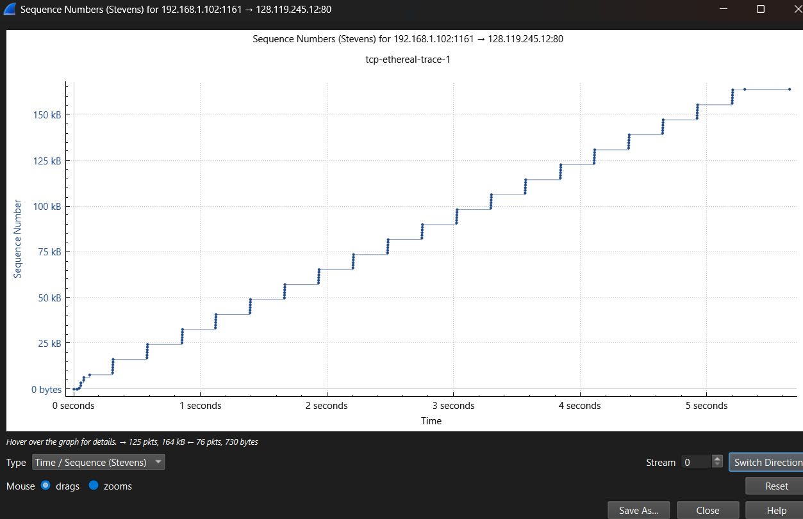  
  
Di awal (0–±1 detik) ukuran Congestion Window bertambah secara eksponensial, itu fase slow start. Setelah fase Slow Start TCP masuk ke fase Congestion Avoidance, dan kemiringan garis akan menjadi lebih landai dan stabil (linear).  