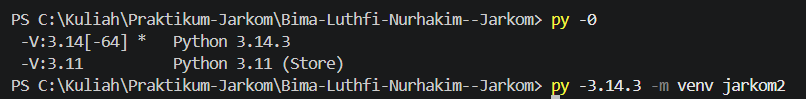
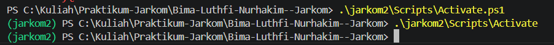
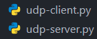
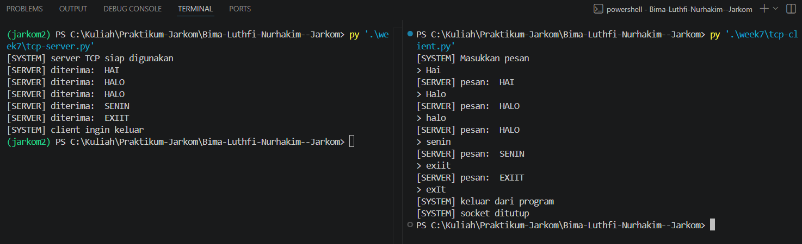
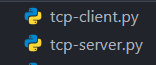
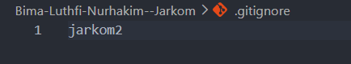
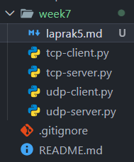

# Laporan praktikun 5 - 13 April 2026
  
| Field       | Data                 |
|-------------|----------------------|
| Nama        | Bima Luthfi Nurhakim |
| Nim         | 103072400030         |
| Kelas       | IF-04-05             |
| Mata Kuliah | Jaringan Komputer    |
  
  
## Tujuan Laprak:
- Modul 7: 1. Mahasiswa bisa membuat program berbasis socket UDP
           2. Mahasiswa bisa membuat program berbasis socket TCP
  
----------------------------------------------------------------------------------------------------------------------------------
  
## 7.1 Pengantar
Typical network application terdiri dari sepasang program—program klien dan program server—yang berada di dua sistem akhir yang berbeda. Ketika kedua program ini dijalankan, proses klien dan proses server dibuat, dan proses ini berkomunikasi satu sama lain dengan membaca dari, dan menulis ke, soket. Saat membuat aplikasi jaringan, tugas utama developer adalah menulis kode untuk program klien dan server.  Ada dua jenis network applications. Pertama adalah implementasi yang operasinya ditentukan dalam standar protokol, seperti RFC atau beberapa dokumen standar lainnya; aplikasi semacam itu kadang-kadang disebut sebagai "terbuka", karena aturan yang menentukan operasinya diketahui semua orang. Untuk implementasi seperti itu, program klien dan server harus sesuai dengan aturan yang ditentukan oleh RFC.
----------------------------------------------------------------------------------------------------------------------------------
  
## Langkah-langkah Modul 7
  
## 7.2 Program Socket dengan UDP
  
Di bagian ini, kita akan menulis program client-server sederhana yang menggunakan UDP dan  menulis program serupa yang menggunakan TCP. Proses yang berjalan pada mesin yang berbeda berkomunikasi satu sama lain dengan mengirimkan pesan ke dalam soket. Kita mengatakan bahwa setiap proses dianalogikan dengan sebuah rumah dan soket proses dianalogikan dengan sebuah pintu. Aplikasi berada di satu sisi pintu di rumah; protokol transport-layer berada di sisi lain pintu di dunia luar. Developer aplikasi memiliki kendali atas segala sesuatu di sisi lapisan aplikasi soket namun, ia memiliki sedikit kontrol dari sisi transport-layer.
----------------------------------------------------------------------------------------------------------------------------------
  
### 7.2.1 udp-client.py

Pertama cek semua versi python kita di terminal VScode. Lalu kita membuat virtual environment Python(sesuai versi Python yang kita pakai).  
  
Code cek semua versi Python :  
```
py -0
```
  
Code membuat venv:  
```
py -3.14.3 -m venv jarkom2
```
  
Lalu aktifkan cirtual environment tadi yang kita buat, disini saya menggunakna PowerShell jadi tambah ".ps1" di akhir code.  
  
Code:  
```
.\jarkom2\Scripts\Activate.ps1
```
  
Lalu buat file udp-client.py dan udp-server.py.  
  
  
Dibawah ini adalah code untuk udp-client.py:  
  
```
from socket import *
import sys

# Konfigurasi alamat dan port server
serverName = '10.16.26.54'
serverPort = 12000

# Inisialisasi socket UDP di luar loop agar tidak dibuat berulang-ulang
clientSocket = socket(AF_INET, SOCK_DGRAM)
clientSocket.settimeout(5)  # Batas waktu tunggu 5 detik

print("Ketik 'exit' untuk mematikan server dan keluar, atau 'keluar' untuk tutup client saja.\n")

try:
    while True:
        # Input pesan dari pengguna
        message = input('Masukkan kalimat lowercase : ')
        
        # Validasi jika input kosong
        if not message:
            continue

        # Mengirim pesan ke server
        clientSocket.sendto(message.encode(), (serverName, serverPort))
        
        # Cek apakah pengguna ingin keluar
        if message.lower() == 'exit':
            print("Perintah exit dikirim. Mematikan server dan menutup klien...")
            break
        elif message.lower() == 'keluar':
            print("Menutup klien...")
            break
        
        try:
            # Menerima balasan dari server
            modifiedMessage, serverAddress = clientSocket.recvfrom(2048)
            print(f"Balasan dari Server: {modifiedMessage.decode()}\n")
        except timeout:
            print("Kesalahan : Server tidak merespons (Timeout).\n")

except Exception as e:
    print(f"Terjadi kesalahan : {e}")
finally:
    # Menutup koneksi socket secara permanen saat loop berhenti
    clientSocket.close()
    print("Koneksi ditutup.")
```
  
Pertama kita mengimpor semua library Socket dan library sys untuk sistem, lalu menkonfigurasi server. berikutnya membuat Socket UDP yang berisi IPv4 dan kita set "error timeout" jika sever tidak merespon dalam waktu 5 detik. Lalu isi pesan untuk cara mematikan server + client dengan mengetik "exit" kata ini tidak terperangruh string lower, upper atau campuran lower-upper karena akan di ubah ke lower. Gunakan while loop agar program berjalan terus sampai user keluar. Didalam loop program akan meminta inputan dari user. Ketika user menginput string akan diubah ke string upper apabila input string lower. lalu akan terus loop, didalam looping inputan user akan di encode() atau diubah menjadi byte. Untuk keluar dari program user harus input  "exit" (tidak dipengaruhi string lower, upper atau campuran lower-upper). Didalam loop inputan akan dikirimkan ke alamat server yang telah ditentukan dengan fungsi send(). Setelah data terkirim, program masuk ke try-except internal untuk menunggu balasan dari server menggunakan recvfrom(2048). Jika server merespons, pesan yang diterima akan didecode menjadi teks dan ditampilkan.  
  
### 7.2.2 udp-server.py
  
Dibawah ini adalah code untuk udp-server.py:  
  
```
from socket import *
import sys

# Konfigurasi server
serverPort = 12000
serverSocket = socket(AF_INET, SOCK_DGRAM)
serverSocket.bind(('', serverPort))

print(f"Server UDP siap menerima pesan pada port {serverPort}")
print("Ketik 'exit' dari sisi klien untuk mematikan server secara remote.\n")

try:
    while True:
        # Menerima pesan dari klien
        message, clientAddress = serverSocket.recvfrom(2048)
        
        # Mendekode pesan
        original_message = message.decode().strip()
        
        # Cek apakah pesan adalah perintah untuk keluar
        if original_message.lower() == 'exit':
            print(f"Mematikan server...")
            break
        
        # Mengubah pesan menjadi huruf kapital
        modifiedMessage = original_message.upper()
        
        # Menampilkan informasi klien dan isi pesan
        print(f"Diterima dari {clientAddress[0]}:{clientAddress[1]}: {original_message}")
        print(f"Mengirim balik : {modifiedMessage}")
        
        # Mengirim kembali pesan yang telah diubah ke klien
        serverSocket.sendto(modifiedMessage.encode(), clientAddress)
        
except Exception as e:
    print(f"\nTerjadi kesalahan : {e}")
finally:
    print("Server telah berhenti.")
    serverSocket.close()
    sys.exit(0)
```
  
Program dimulai dengan membuat socket UDP yaitu SOCK_DGRAM. Tidak seperti client, server harus melakukan bind, yaitu memasukkan port sesuai dengan praktikum yaitu 12000 agar sistem tahu bahwa semua data yang masuk ke port tersebut harus dikirim ke program ini. Kemudian Server masuk ke loop dengan while True yang membuatnya terus berjalan tanpa berhenti. Di dalam loop ini, fungsi serverSocket.recvfrom(2048) akan memblokir eksekusi program sampai ada data yang datang dari client. Ketika data datang, server mendapatkan dua hal yaitu pesan dan alamat pengirim. Setelah pesan diterima dan didekode menjadi teks, server melakukan pengecekan kondisi. Jika client mengirimkan 'exit', server akan memberi output pesan penutup dan keluar dari loop. Jika pesan berupa teks biasa, server akan mengubah teks itu menjadi huruf kapital menggunakan fungsi .upper(). dan terakhir adalah mengirimkan kembali teks yang sudah diubah ke client menggunakan fungsi send(), dengan clientAddress yang didapat sebagai tujuan. dan seluruh proses dijadikan satu dalam try-except-finally.  
  
Ini adalah contoh implementasinya:  
  
  
## 7.3 Program Socket dengan TCP
  
Selanjutnya adalah membuat program dengan socket yaitu TCP setelah melakukan praktikum dengan UDP. TCP merupakan protokol berorientasi koneksi. Ini berarti bahwa sebelum client dan server dapat mulai mengirim data satu sama lain, mereka harus terlebih dahulu handshake dan membuat koneksi TCP.Saat membuat koneksi TCP, kita mengaitkannya dengan alamat soket client dan alamat soket server. Dengan koneksi TCP dibangun, ketika satu sisi ingin mengirim data ke sisi lain, itu hanya memasukkan data ke dalam koneksi TCP melalui soketnya.
----------------------------------------------------------------------------------------------------------------------------------
  
### 7.3.1 tcp-client.py
  
Lalu buat file tcp-client.py dan tcp-server.py.  
  
  
Dibawah ini adalah code untuk tcp-client.py:  
  
```
# SOCKRT = penjumlahan, pengurangan, perkalian, pembagian
from socket import * # import all

serverName = "localhost"
serverPort = 12000

# AF_INET = ipv4 | SOCK_STREAM = TCP
clientSocket = socket(AF_INET, SOCK_STREAM)

# hubungan | connect
clientSocket.connect(
    (serverName, serverPort)
)

print("[SYSTEM] Masukkan pesan")

running = True
while running:

    # input
    message = input("> ")

    # mengirim ke server
    # endcode = abcdef = 101010101010101001011
    clientSocket.send(message.encode())

    # kalau user ketik "exit, Exit, EXIT" = socket ditutup
    if message.lower() == "exit":
        print("[SYSTEM] keluar dari program")
        running = False
        break

    # menerima pesan dari server
    # abc = 10101010101
    modifiedMessage = clientSocket.recv(2048)

    print("[SERVER] pesan: ", modifiedMessage.decode())

# menutup socket yg tidak dipakai
clientSocket.close()
print("[SYSTEM] socket ditutup")
```
  
Pertama program menginisiasi alamat server sebagai localhost dengan alamat host yaitu 12000. Kemudian saat membuat objek socket, menggunakan SOCK_STREAM dimana komunikasi akan menggunakan protokol TCP. Setelah koneksi berhasil dibuat, program masuk ke dalam loop menggunakan while running. Berbeda seperti sebelumnya itu UDP ini pengiriman data tidak lagi menggunakan send(), melainkan menggunakan .send(). Hal ini dikarenakan socket sudah terconnect alamat server tujuan sejak proses koneksi di awal. Sesuai dengan definisinya TCP ini akan mengirimkan data sampai ke tujuan dengan urutan yang benar dan tanpa kerusakan. Kemudian Sama seperti sebelumnya ada kondisi untuk berhenti. Jika user mengetik "exit", pesan itu tetap dikirim ke server, dan variabel running diubah menjadi False untuk memutus loopn. Jika pesannya bukan perintah keluar, client akan menunggu balasan dari server melalui clientSocket.recv(2048). Setelah keluar dari loop, program menjalankan clientSocket.close().  
  
### 7.3.2 tcp-server.py
  
```
from socket import *

serverPort = 12000
serverSocket =  socket(AF_INET, SOCK_STREAM)

# sudah meng-bind server
serverSocket.bind(
    ('', serverPort)
)

# server siap menerima koneksi
serverSocket.listen(1)
print("[SYSTEM] server TCP siap digunakan")

running = True
while running:

    # menyetujui koneksi dari client
    connetionSocket, addr = serverSocket.accept()

    while True:
        # pesan yg diterima = 10101010
        message = connetionSocket.recv(2048).decode()
        if not message:
            break

        # cek apakah "exit"?
        if message.lower() == "exit":
            print("[SYSTEM] client ingin keluar")
            running = False
            break

        # memodifikasi menjadi capslock
        modifiedMessage = message.upper()
        print("[SERVER] diterima: ", modifiedMessage)

        # kirim ke client
        connetionSocket.send(
            modifiedMessage.encode()
        )

    connetionSocket.close()

serverSocket.close()
```
  
Pertama membuat socket. server melakukan bind ke port 12000. kemudian membuat serverSocket.listen(1) yang dimana ini berguna untuk mengubah socket menjadi mode pasif, menerima permintaan koneksi dari client. Angka 1 disana menunjukan ukuran antrean yang berarti server akan nge-queue satu koneksi sebelum menolak koneksi lainnya. Lalu Program memasuki loop dan blocking pada code serverSocket.accept(). Pada saat client mencoba terhubung, fungsi ini akan menangkap koneksi dan menghasilkan dua objek yaitu connectionSocket dimana ini merupakan Sebuah socket baru yang khusus digunakan hanya untuk berkomunikasi dengan client dan ada juga addr dimana ini berisikan alamat IP dan port client. Setelah koneksi terjalin, server masuk ke looping menggunakan while true kedua. Di sini, server membaca data menggunakan .recv(2048). Dalam TCP, jika recv mengembalikan pesan kosong, itu adalah sinyal bahwa client telah memutus koneksi, sehingga program akan melakukan break. Jika pesan yang diterima adalah "exit", server akan menandai variabel running = False. Lalu Setiap pesan teks yang masuk akan diubah menjadi huruf kapital menggunakan .upper() dan dikirim kembali ke klien lewat connectionSocket.send(). Setelah looping yang didalam selesai. connectionSocket.close() dipanggil untuk menutup jalan komunikasi dengan client dan jika running sudah bernilai False, socket utama serverSocket juga akan ditutup untuk menghentikan program.  
  
Ini adalah contoh implementasinya:  
  
  
Untuk folder venv tidak terlihat buat file ".gitignore" dimana ditempatkan pada tingkat yang sama dengan folder jarkom2, lalu isi file tersebut dengan "jarkom2"(nama file venv).   
  
  
  
Isi Folder week 7:
  