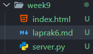
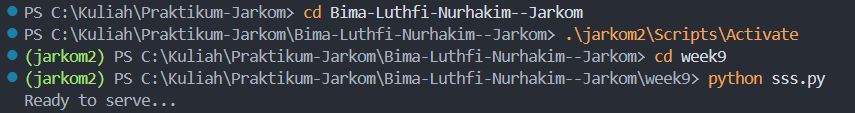
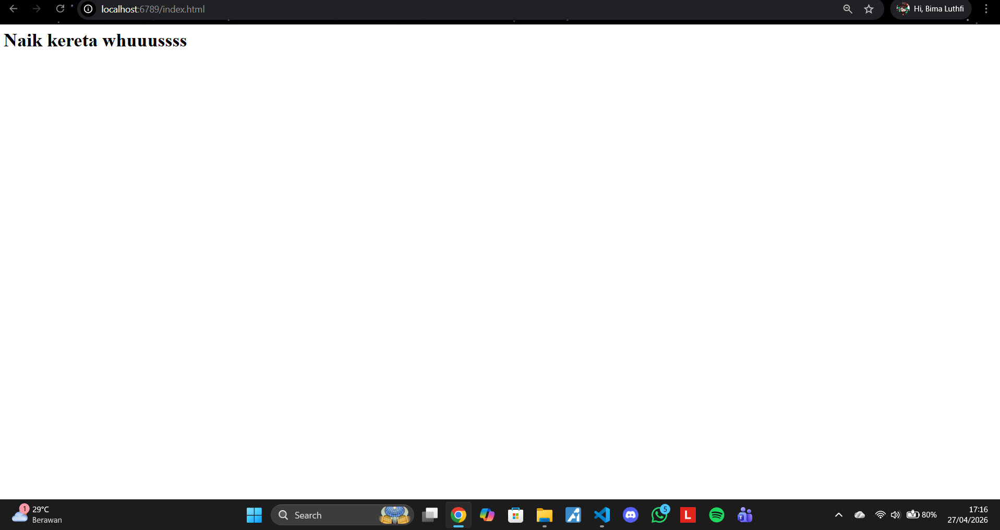
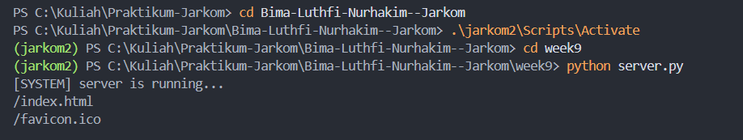

# Laporan praktikun 6 - 27 April 2026
  
| Field       | Data                 |
|-------------|----------------------|
| Nama        | Bima Luthfi Nurhakim |
| Nim         | 103072400030         |
| Kelas       | IF-04-05             |
| Mata Kuliah | Jaringan Komputer    |
  
  
## Tujuan Laprak:
- Modul 9: 1. Mahasiswa bisa membuat program web server sederhana berbasis TCP socket programming.
  
----------------------------------------------------------------------------------------------------------------------------------
  
## 9.1 Pengantar
  
Pada modul ini, Anda akan mempelajari dasar-dasar pemrograman soket untuk koneksi TCP dengan Python: cara membuat soket, mengikatnya ke alamat dan port tertentu, serta mengirim dan menerima paket HTTP. Anda juga akan mempelajari beberapa dasar format header HTTP. Anda akan mengembangkan server web yang menangani satu permintaan HTTP pada satu waktu. Server web Anda harus menerima dan mengurai permintaan HTTP, mendapatkan file yang diminta dari sistem file server, membuat pesan respons HTTP yang terdiri dari file yang diminta yang didahului oleh baris header, dan kemudian mengirim respons langsung ke klien. Jika file yang diminta tidak ada di server, server harus mengirim pesan HTTP "404 Not Found" kembali ke klien. 
  
## Langkah-langkah Modul 9
  
## 9.1 Web Server
  
Pertama kita membuat file Python untuk web server.

  
Ini adalah code Python untuk web server.
```python
#import socket module 
from socket import * 
import sys # In order to terminate the program 
serverSocket = socket(AF_INET, SOCK_STREAM)

serverPort = 6789
serverSocket.bind(('', serverPort))
serverSocket.listen(1)

while True: 
    #Establish the connection 
    print('Ready to serve...') 
    connectionSocket, addr = serverSocket.accept()
    try: 
        message = connectionSocket.recv(1024).decode()
        filename = message.split()[1]                
        f = open(filename[1:])                         
        outputdata = f.read() 
        
        connectionSocket.send("HTTP/1.1 200 OK\r\n\r\n".encode())

        for i in range(0, len(outputdata)):            
            connectionSocket.send(outputdata[i].encode())
        
        connectionSocket.send("\r\n".encode()) 
        connectionSocket.close()

    except IOError: 
        connectionSocket.send("HTTP/1.1 404 Not Found\r\n\r\n".encode())
        connectionSocket.send("<html><body><h1>404 Not Found</h1></body></html>\r\n".encode())

        serverSocket.close()

    serverSocket.close()
    sys.exit()
```
Selanjutnya kita membuat file HTML, untuk headernya terserah kita.

  
```
<h1> Naik kereta whuuussss</h1>
```
  
Kita aktifkan Virtual Environment(venv).

  
Selanjutnya kita buka web browser, kita ketik [link web server](http://localhost:6789/index.html), kita pakai local host 6789 karena pada code server.py kita mengaitkannya/bind ke host 6789.
  
Lalu akan muncul tampilan yang sesuai dengan file HTML kita.

  
## 9.2  Latihan Tambahan
  
Saat ini, server web hanya menangani satu permintaan HTTP dalam satu waktu. Menerapkan server multithreaded yang mampu melayani beberapa permintaan secara bersamaan. Dengan menggunakan threading, pertama-tama buat thread utama di mana server Anda yang dimodifikasi  mendengarkan klien di port tetap. Ketika menerima permintaan koneksi TCP dari klien, itu akan mengatur koneksi TCP melalui port lain dan melayani permintaan klien di thread terpisah. Akan ada koneksi TCP terpisah di thread terpisah untuk setiap pasangan permintaan/respons.2. Daripada menggunakan browser, tulis klien HTTP Anda sendiri untuk menguji server Anda. Klien Anda akan terhubung ke server menggunakan koneksi TCP, kirim Permintaan HTTP ke server, dan menampilkan respons server sebagai output. Anda dapat mengasumsikan bahwa permintaan HTTP yang dikirim adalah metod GET. Klien harus mengambil argumen baris perintah yang menentukan alamat IP server atau nama host, port tempat server listening berada, dan jalur di mana objek yang diminta disimpan di server. Berikut ini adalah format perintah input untuk menjalankan klien.
  
```python
from socket import *
import threading

def handle_client(connectionSocket):
    try:
        # meneria pesan user
        message = connectionSocket.recv(1024).decode()

        # index.html, hello.html
        message = message[4:16]# message = /GET /index.html HTTP/1.1
        print(message)

        # membuka index.html serta menghilangkan "/"
        f = open(message[1:])
        
        # membaca file.html
        outputData = f.read()

        # kirim respon
        connectionSocket.send(
            "HTTP/1.1 200 OK\r\n\r\n".encode()
        )

        # kirim data
        connectionSocket.sendall(outputData.encode())

        # tutup koneksi
        connectionSocket.close()
    
    except IOError:
        # kirim respon bila tidak ditemukan
        connectionSocket.send(
            "HTTP/1.1 404 Not Found\r\n\r\n".encode()
        )

        # kiirm data 404
        connectionSocket.send(
            "<h1>404 Not found</h1>".encode()
        )

        # tutup koneksi
        connectionSocket.close()

serverSocket = socket(AF_INET, SOCK_STREAM)
serverSocket.bind(('', 6789))
serverSocket.listen(5)  # dapat menerima 5 client
print("[SYSTEM] server is running...")

while True:
    connectionSocket, addr = serverSocket.accept()

    # membuat thread dan target thread-nya beserta parameter
    thread = threading.Thread(
        target = handle_client,
        args = (connectionSocket,)
)
    # menjalankan
    thread.start()
```

Lalu kita run.

  
Selanjutnya kita buka web browser, kita ketik [link web server](http://localhost:6789/index.html), kita pakai local host 6789 karena pada code server.py kita mengaitkannya/bind ke host 6789.
  
Lalu akan muncul tampilan yang sesuai dengan file HTML kita.
